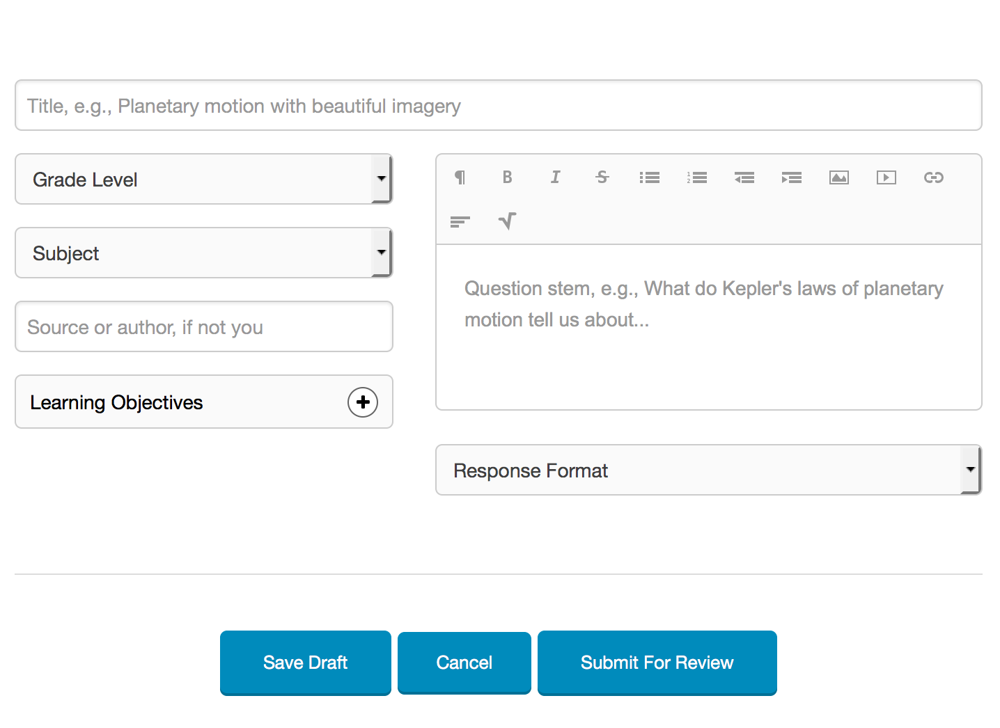

# Introduction {#introduction}

This chapter introduces two resources we'll be using throughout the book, including the assessment development tools at [Proola.org](http://proola.org), and the statistical software R. The chapter ends with an introductory statistics review. The learning objectives focus on understanding statistical terms, and calculating and interpreting some introductory statistics.

```{block, type="objectives"}
**Learning objectives**

1. Identify and use statistical notation for variables, sample size, mean, standard deviation, variance, and correlation.
2. Calculate and interpret frequencies, proportions, and percentages.
3. Create and use frequency distribution plots to describe the central tendency, variability, and shape of a distribution.
4. Calculate and interpret measures of central tendency and describe what they represent, including the mean, median, and mode.
5. Calculate and interpret measures of variability and describe what they represent, including the standard deviation and variance.
6. Apply and explain the process of rescaling variables using means and standard deviations for linear transformations.
7. Calculate and interpret the correlation between two variables and describe what it represents in terms of the shape, direction, and strength of the linear relationship between the variables.
8. Create and interpret a scatter plot, explaining what it indicates about the shape, direction, and strength of the linear relationship between two variables.
```

## Proola

Proola is a web application for collaborative assessment development. It was created specifically for individuals looking for practice and support in the item writing process. There's a simple interface for creating assessment items, and features for reviewing and commenting on the items of your peers.

You need to set up a free account at [proola.org/users/sign_up](http://proola.org/users/sign_up) before you can complete the assignments in later chapters. Once you have an account, you can start writing and commenting on items.

Some things to keep in mind as you get started:

* The site itself is still under development, with new features on the way. Report bugs or send suggestions to <contact@proola.org>.
* Everything you share is public. Don't post copyrighted items, images, or other information, and don't share items you need to keep secure.
* You can learn a lot from the successes and failures of others. Search the bank for items related to your content area, and then see where people struggle and what they do well.

The Proola item writing process is broken down into four general steps (see [proola.org/learn_more](http://proola.org/learn_more)).

First, create a new item by clicking "Share" in the top navbar. This takes you to a series of text boxes and drop-downs where you'll provide basic information about your item. See Figure \@ref(fig:proola-interface) for an example. Give the item a short but descriptive title. Next, link the item to a learning objective. Learning objectives can be imported from other users, or you can organize your own objectives in Proola. Then, choose from a variety of intended subject areas and grade levels. The item itself then consists of a stem, where the question statement or prompt resides, and a response format, whether selected-response or constructed-response. Any other background information you'd like to share can go in the comments that become available once your question is saved.

```{r proola-interface, echo=FALSE, out.width='75%', fig.cap="Proola interface for drafting a new item."}

```

Second, get feedback from peers and assessment specialists. Once an item is saved as a draft, anyone can view and comment on it. Wait patiently for comments, or recruit peers in your grade level, subject area, department, school, district, and get them to sign up and leave feedback. Assessment specialists include faculty and graduate students with training in assessment development who contribute to the Proola community. Comments are listed below your item. After signing up for an account, see [proola.org/items/439](http://proola.org/items/439) and [proola.org/items/296](http://proola.org/items/296) for examples.

When commenting or responding to comments, remember to be constructive. Comments will naturally flow toward the limitations of an item. You should highlight strengths as well as weaknesses, and always provide suggestions for improvement. Make reference to the item writing guidelines, as flawed items tend to miss one or more of them. Finally, comment on the scope of an item, that is, how well it addresses the intended learning objective at the appropriate depth of knowledge.

Third, edit and improve your item based on feedback. Focus on the item writing guidelines and your selected learning objective. Aim for the highest depth of knowledge. Double-check for clarity and correct spelling and grammar.

Finally, submit for review to share with the community. After submitting an item, there's no turning back. You and others can still comment, but edits are locked until a formal peer review is complete. When revisions are recommended, edits can only be made to a new version of the item. Previous versions are viewable but not editable.

Revise and repeat this process as needed up to four times. Once approved, your item can be saved, printed, and exported by other users.

The test development and item writing processes will be covered in detail in Chapter \@ref(development). For now, you should sign up for an account and become familiar with how the site is organized. At the end of this chapter are some item writing activities to try.

## R

R is both a programming language and software environment for statistical analysis. It differs from other software like SPSS in three key ways. First, R is free, no strings (or warranties) attached. Download it at [cran.r-project.org](https://cran.r-project.org/). The popular editor RStudio is also available for free at [rstudio.com](https://www.rstudio.com/). Second, R is open-source, with thousands of active contributors sharing add-on packages. See the full list at [cran.r-project.org/web/packages](https://cran.r-project.org/web/packages/) (there are currently over 8,000 packages). Third, R is accessed primarily through code, rather than by pointing and clicking through drop-down menus and dialog windows. This third point is a road block to some, but it ends up being a strength in the long run.

At this point you should download and install R and RStudio using the links above. The internet abounds with helpful tips on installation and getting started. Here are a few pointers.

* R is the software that runs all your analyses. RStudio is an _Integrated Development Environment_ or IDE that simplifies your interaction with R. RStudio isn't essential, but it gives you nice features for saving your R code, organizing the output of your analyses, and managing your add-on packages.

* As noted above, R is accessed via code, primarily in the form of commands that you'll type or paste in the R console. The R console is simply the window where your R code goes, and where output will appear. Note that RStudio will present you with multiple windows, one of which will be the R console. That said, when instructions here say to run code in R, this applies to R via RStudio as well.

* When you type or paste code directly into the R console, any previous code you've already entered gets pushed up on the screen. In the console, you can scroll through your old code by hitting the up arrow once your cursor is in front of the R prompt `>`. In RStudio, you can also view and scroll through a list of previous commands by holding one of the control/command buttons on your keyboard while hitting up.

* Only type directly in the console for simple and quick calculations that you don't care about forgetting. Otherwise, type all your code in a text file that is separate from the console itself. In R and RStudio, these text files are called R scripts. They let you save your code in a separate document, so you always have a structured record of what you've done. Remember that R scripts are only used to save code and any comments annotating the code, not data or results.

### Code

We'll start our tour of R with a summary of how R code is used to interact with R via the console. In this book, blocks of example R code are offset from the main text as shown below. Comments within code blocks start with a single hash `#`, the code itself has nothing consistent preceding it, and output from my R console is preceded by a double hash `##`. You can copy and paste example code directly into your R console. Anything after the `#` will be ignored.

```{r first-example, append=TRUE, chap=1}
# This is a comment within a block of R code. Comments start with the
# hash sign and are ignored by R. The code below will be interpreted
# by R once you paste or type it into the console.
x <- c(4, 8, 15, 16, 23, 42)
mean(x)  # Only code after the hash is ignored
sd(x)
```

In the code above, we're creating a short vector of scores in `x` and calculating its mean and standard deviation. You should paste this code in the console and verify that you get the same results. Note that code you enter at the console is preceded by the R prompt `>`, whereas output printed in your console is not.

The first thing to notice about the example code above is that the functions that get things done in R have names, and to use them, we simply call them by name with parentheses enclosing any required information or instructions for how the functions should work. Whenever functions are discussed in this book, you'll recognize them by the parentheses. For example, we used the function `c()` to combine a set of numbers into a "vector" of scores. The information supplied to `c()` consisted of the scores themselves, separated by commas. `mean()` and `sd()` are functions for obtaining the mean and standard deviation of vectors of scores, like the ones in `x`.

The second thing to notice in the example above is that data and results are saved to "objects" in R using the assignment operator `<-`. We used the concatenate function to stick our numbers together in a set, `c(4, 8, 15, 16, 23, 42)`, and then we assigned the result to have the name `x`. Objects created in this way can be accessed later on by their assigned name, for example, to find a mean or standard deviation. If we wanted to access it later, we could also save the mean of `x` to a new object.


```{r, append=TRUE, chap=1}
# Calculate the mean of x
mx <- mean(x)
# Print x and the mean of x
x
mx
print(mx)
```

When the output from a function is stored in an R object, you typically don't see the output printed to the console. If we type an object name at the console, R does its best to print out the contents, as shown above for `mx` and `x`. This is simply a shortcut for using the `print()` function on the object.

Note that for larger objects, like `data.frame`s with lots of rows and columns, viewing all the data at once isn't very helpful. In this book we'll analyze data from the Programme for International Student Assessment (PISA), with dozens of variables measured for thousands of students. Printing all the PISA data would flood the console with information. This brings us to the third thing to notice about the example code above, that the console isn't the best place to view results. The console is functional and efficient, but it isn't pretty or well organized. Fortunately, R offers other mediums besides fixed-width text for visualizing output, discussed below.

### Packages

When you install R on your computer, you get a variety of functions and example data sets by default as part of the base packages that come with R. For example, `mean()` and `print()` come from the base R packages. Commonly used procedures like simple linear regression, via `lm()`, and t-testing, via `t.test()`, are also included in the base packages. Additional functionality comes from add-on packages written and shared online by a community of R enthusiasts.

The examples in this book rely on a few different R packages. The book itself is compiled using the bookdown and knitr packages [@xie2015bookdown; @xie2016knitr], and some knitr code is shown for formatting output tables. The ggplot2 package [@wickham2009ggplot2] is used for plotting. In this chapter we also need the devtools package [@wickham2016devtools], which allows us to install R packages directly from the code sharing website [github.com](https://github.com/). Finally, throughout the book we'll then be using a package called epmr, which contains functions and data used in many of the examples.

Packages published to the official R website CRAN are initially installed using `install.packages()`. You only need to do this once per package. Each time you open a new R session, you load the package with `library()` to use it. Alternatively, you can use individual functions without explicitly loading a package by referencing both the package and function at each use, separated by `::`.

devtools, knitr, and ggplot2 are on CRAN. The development version of epmr is not yet on CRAN and must be installed using `devtools::install_github()`.

```{r, eval=FALSE, append=TRUE, chap=1}
# Some examples require data and functions from add-on R packages
# This will install required packages - you only need to do this once
install.packages("devtools")
install.packages("knitr")
install.packages("ggplot2")
# This will install epmr from github
devtools::install_github("talbano/epmr")
```

```{r, echo=FALSE, include=FALSE}
devtools::install_github("talbano/epmr")
```

```{r, append=TRUE, chap=1}
# Load required packages - do this every time you restart R
library("epmr")
library("ggplot2")
```

After a package is installed, and you've run `library()`, you have access to the functionality of the package. Here, we've loaded epmr and ggplot2 so we can type functions directly, without referencing the package name each time. Because both of these packages contain a function called `alpha()`, we do have to reference the package name when using this function later in Chapter \@ref(reliability).

### Getting help

Help files in R are easily accessed by entering a function name preceded by a question mark, for example, `?c`, `?mean`, or `?devtools::install_github`. Parentheses aren't necessary. The question mark approach is a shortcut for the `help()` function, where, for example, `?mean` is the same as `help("mean")`. Either approach provides direct access to the R documentation for a function.

The documentation for a function should at least give you a brief description of the function, definitions for the arguments that the function accepts, and examples of how the function can be used.

At the console, you can also perform a search through all of the available R documentation using two question marks. For example, `??"regression"` will search the R documentation for the term "regression." This is a shortcut for the function `help.search()`. Finally, you can browse through the R documentation with `help.start()`. This will open a web browser with links to manuals and other resources.

If you're unsatisfied with the documentation internal to R, an online search can be surprisingly effective for finding function names or instructions on running a certain procedure or analysis in R.

### Data

Data can be entered directly into the console by using any of a variety of functions for collecting information together into an R object. These functions typically give the object certain properties, such as length, rows, columns, variable names, and factor levels. In the code above, we created `x` as a vector of quantitative scores using `c()`. You could think of `x` as containing test scores for a sample of `length(x)` `r length(x)` test takers, with no other variables attached to those test takers.

We can create a factor by supplying a vector of categorical values, as quoted text, to the `factor()` function.

```{r, append=TRUE, chap=1}
# Create a factor variable
classroom <- c("A", "B", "C", "A", "B", "C")
classroom <- factor(classroom)
classroom[c(1, 4)]
```

In this code, the `classroom` object is first assigned a vector of letters, which might represent labels for three different classrooms. The classroom object is then converted to a factor, and assigned to an object of the same name, which essentially overwrites the first assignment. Reusing object names like this is usually not recommended. This is just to show that a name in R can't be assigned two separate objects at once.

The code above also demonstrates a simple form of indexing. Square brackets are used after some R objects to select subsets of their elements, for example, the first and fourth values in `classroom`. The vector `c(1, 4)` is used as an indexing object. Take a minute to practice indexing with `x` and `classroom`. Can you print the last three classrooms? Can you print them in reverse order? Can you print the first score in `x` three times?

The `data.frame()` function combines multiple vectors into a set of variables that can be viewed and accessed as a matrix with rows and columns.

```{r, append=TRUE, chap=1}
# Combine variables as columns in a data frame
mydata <- data.frame(scores = x, classroom)
mydata[1:4, ]
```

We can index both the columns and rows of a matrix. The indexing objects we use must be separated by a comma. For example, `mydata[1:3, 2]` will print the first three rows in the second column. `mydata[6, 1:2]` prints both columns for the sixth row. `mydata[, 2]`, with the rows index empty, prints all rows for column two. Note that the comma is still needed, even if the row or column index object is omitted. Also note that a colon `:` was used here as a shortcut function to obtain sequences of numbers, where, for example, `1:3` is equivalent to typing `c(1, 2, 3)`.

Typically, we'll import or load data into R, rather than enter it manually. Importing is most commonly done using `read.table()` and `read.csv()`. Each one takes a "file path" as its first argument. See the help documentation for instructions on their use and the types of files they require. Data and any other objects in the console can also be saved directly to your computer using `save()`. This creates an "rda" file, which can then be loaded back in to R using `load()`. Finally, some data are already available in R and can be loaded into our current session with `data()`. The PISA data, referenced above, are loaded with `data(PISA09)`. Make sure the epmr package has been loaded with `library()` before you try to load the data.

The `PISA09` object is a `data.frame` containing demographic, noncognitive, and cognitive variables for a subset of questions and a subset of students from the PISA 2009 study ([nces.ed.gov/surveys/pisa](https://nces.ed.gov/surveys/pisa/)). It is stored within the epmr R package that accompanies this book. After loading the data, we can print a few rows for a selection of variables, accessed via their sequential column number, and then the first 10 values for the age variable.

```{r, append=TRUE, chap=1}
# Load the PISA data set and print subsets of it
data(PISA09)
PISA09[c(1, 10000, 40000), c(1, 6, 7, 38)]
PISA09$age[1:10]
```

The dollar sign `$` is used to access a single variable by name within a `data.frame`. Here, we've printed `age`, measured in years, for the first ten students in the data set. The different variables in `PISA09` will be described in later chapters. For a quick overview, see the help file. Documentation for data sets is accessed in the same way as documentation for functions.

## Intro stats

> Facts are stubborn things, but statistics are pliable.  
> --- *Mark Twain*

With the basics of R under your belt, you're now ready for a review of the introductory statistics that are prerequisite for the analyses that come later in this book.

Many people are skeptical of statistics, and for good reasons. We often encounter statistics that contradict one another or that are appended to fantastic claims about the effectiveness of a product or service. At their heart, statistics are pretty innocent and shouldn't be blamed for all the confusion and misleading. Statistics are just numbers designed to summarize and capture the essential features of larger amounts of data or information.

Statistics are important in measurement because they allow us to score and summarize the information collected with our tests and instruments. They're used to describe the reliability, validity, and predictive power of this information. They're also used to describe how well our test covers a domain of content or a network of constructs, including in relation to other content areas or constructs. We rely heavily on statistics in Chapters \@ref(measurement) and \@ref(reliability) through \@ref(irt).

### Some terms

We'll begin this review with some basic statistical terms. First, a *variable* is a set of values that can differ for different people. For example, we often measure variables such as *age* and *gender*. These are italicized here to denote them as statistical variables, as opposed to words. The term *variable* is synonymous with quality, attribute, trait, or property. Constructs are also variables. Really, a variable is anything assigned to people that can potentially take on more than just a single constant value. As noted above, variables in R can be contained within simple vectors, for example, `x`, or they can be grouped together in a `data.frame`.

Generic variables will be labeled in this book using capital letters, usually $X$ and $Y$. Here, $X$ might represent a generic test score, for example, the total score across all the items in a test. It might also represent scores on a single item. Both are considered variables. The definition of a generic variable like $X$ depends on the context in which it is defined.

Indices can also be used to denote generic variables that are part of some sequence of variables. Most often this will be scores on items within a test, where, for example, $X_1$ is the first item, $X_2$ is the second, and $X_J$ is the last, with $J$ being the number of items in the test and $X_j$ representing any given item. Subscripts can also be used to index individual people on a single variable. For example, test scores for a group of people could be denoted as $X_1$, $X_2$, $\dots$, $X_N$, where $N$ is the number of people and $X_i$ represents the score for a generic person. Combining people and items, $X_{ij}$ would be the score for person $i$ on item $j$.

The number of people is denoted by $n$ or sometimes $N$. Typically, the lowercase  $n$ represents sample size and the uppercase $N$ represents the population, however, the two are often used interchangeably. Greek and Arabic letters are used for other sample and population statistics. The sample mean is denoted by $m$ and the population mean by $\mu$, the standard deviation is $s$ or $\sigma$, variance is $s^2$ or $\sigma^2$, and correlation is $r$ or $\rho$. Note that the mean and standard deviation are sometimes abbreviated as $M$ and $SD$. Note also that distinctions between sample and population values often aren't necessary, in which case the population terms are used. If a distinction is necessary, it will be identified.

Finally, you may see named subscripts added to variable names and other terms, for example, $M_{control}$ might denote the mean of a control group. These subscripts depend on the situation and must be interpreted in context.

### Descriptive and inferential

Descriptive and inferential are terms that refer to two general uses of statistics. These uses differ based on whether or not an inference is made from properties of a sample of data to parameters for an unknown population. Descriptive statistics, or descriptives, are used simply to explore and describe certain features of distributions. For example, the mean and variance are statistics identifying the center of and variability in a distribution. These and other statistics are used inferentially when an inference is made to a population 

Descriptives are not typically used to answer research questions or inform decision making. Instead, inferential statistics are more appropriate for these less exploratory and more confirmatory .

Inferential statistics involve an inference to a parameter or a population value. The quality of this inference is gauged using statistical tests that index the error associated with our estimates. In this review we're focusing on descriptive statistics. Later we'll consider some inferential applications.

The `dstudy()` function in the epmr package returns some commonly used univariate descriptive statistics, including the mean, median, standard deviation (sd), skewness (skew), kurtosis (kurt), minimum (min), and maximum (max). Each is discussed further below. The `dstudy()` function also returns the number of people (n) and the number of people with missing data (na).

```{r, append=TRUE, chap=1}
# Get descriptive statistics for three variables in PISA09
dstudy(PISA09[, c("elab", "cstrat", "memor")])
```

```{block, type="learning-check"}
**Learning check**: What is the main difference between descriptive and inferential statistics?
```

### Distributions

A variable for a given sample of people can be summarized by counting up the numbers of people having the same values. The result is a *frequency distribution*, where each total number of people is a *frequency* denoted by $f$. For example, the categorical variable $X$ representing eye color may have three distinct values in a classroom of $n=20$ students: blue, brown, and green. A frequency distribution would simply total up the number of students with each color, for example, $f_{blue} = 8$.

A frequency can be converted to a *proportion* by dividing it by the sample size. For example, $p_{blue} = f_{blue}/n$. Multiplying by $100$ then gives you a percentage. Frequencies, proportions, and percentages all describe the same information for values within a distribution, but in slightly different ways.

Lets look at some frequencies within the PISA data. The first variable in `PISA09`, named `cnt`, is classified as a factor in R, and it contains the country that each student was tested in. We can check the class and then use a frequency `table()` to see the number of students from each country.

```{r, append=TRUE, chap=1}
# Check the class of the country variable and create a frequency table
class(PISA09$cnt)
table(PISA09$cnt)
```

To convert the frequencies of students by country into percentages, we can divide the table output by the number of students, that is, the number of rows, in `PISA09`, and then multiply by 100. We can then `round()` the result to 2 decimal places. This tells us the percentage of students in each country, relative to all $N =$ `r nrow(PISA09)` students.


```{r, append=TRUE, chap=1}
# Convert a frequency table for country to percentages, then round the result
cntpct <- table(PISA09$cnt) / nrow(PISA09) * 100
round(cntpct, 2)
```

```{block, type="learning-check"}
**Learning check**: What is the sum of all the frequencies in a distribution? What is the sum of a distribution of proportions, and of percentages?
```

Bar charts and histograms are visual representations of frequency distributions, where a bar chart shows a bar for each frequency and a histogram may collapse some bars to improve interpretation with continuous variables, that is, variables where people don't fit into a discrete set of categories. A bar chart works well with a categorical factor like country. For a somewhat continuous variable like `PISA09$memor`, a histogram is more appropriate. `memor` is one of the scale scores produced by PISA. It measures the extent to which students report using memorization strategies when reading to understand text.

```{r barplot-cnt, append=TRUE, chap=1, fig.show='hold', out.width='50%', fig.cap="A bar plot of student frequencies by country in the first plot, and a histogram of memor scores in the second."}
# Create a bar chart for the number of students by country
ggplot(PISA09, aes(cnt)) + geom_bar(stat = "count")
# Histograms are more appropriate for continuous or somewhat continuous scores
qplot(PISA09$memor, binwidth = .5)
```

A box plot, also known as a box and whisker plot, displays a distribution of scores using five summary statistics: the minimun, first quartile (below which 25\% of people score), second quartile (the median or 50th percentile), third quartile (below which 75\% of people score), and the maximum. In R, these statistics can be obtained using `summary()`. The box in a box plot captures the interquartile range, and the whiskers extend roughly to the minimum and maximum values, with outliers sometimes noted using points. Box plots are used here to compare the distributions of memor scores by country.

```{r, append=TRUE, chap=1}
# Create a series of box plots for memor scores by country
ggplot(PISA09, aes(cnt, memor)) + geom_boxplot()
```

Note that these plotting functions come from the ggplot2 package. As alternatives, the base package contains `barplot()`, `hist()`, and `boxplot()`, which will also get the job done. You don't need to understand all the details of the plotting syntax right now, but you should be able to modify the example code given here to examine the distributions of other variables.

Some distributions have notable shapes. For example, a distribution with the same or very similar amounts of people having each value is referred to as a *uniform distribution*. Plot the distribution of `PISA09$age` and you'll see a good example. A distribution is called a *normal distribution* when certain amounts of it fall within a central midpoint. For example, in a normal distribution, roughly 68\% of scores should be found within 1 standard deviation the mean, and frequencies should decrease and taper off as they get further away from the center. A distribution that tapers off to the left but not the right is described as negatively skewed, whereas tapering to the right but not left is positive skew. Finally, a distribution that is more peaked than normal is called leptokurtic, with high kurtosis, and a distribution that is less peaked than normal is platykurtic, with low kurtosis.

```{block, type="learning-check"}
**Learning check**: Describe the difference between a bar chart and histogram, with examples of when each one is used.
```

### Central tendency

Central tendency provides statistics that describe the middle, most common, or most normal value in a distribution. The mean, which is technically only appropriate for interval or ratio scaled variables, is the score that is closest to all other scores. The mean also represents the balancing point in a distribution, so that the further a score is from the center, the more pull it will have on the mean in a given direction. The mean for a variable $X$ is simply the sum of all the $X$ scores divided by the sample size:

\begin{equation}
\mu = \frac{\sum_{i=1}^{n}X_i}{n}.
(\#eq:mean)
\end{equation}

The median is the middle score in a distribution, the score that divides a distribution into two halves with the same number of people on either side. The mode is simply the score or scores with the largest frequencies.

The mean is by far the most popular measure of central tendency, in part because it forms the basis of many other statistics, including standard deviation, variance, and correlation. As a result, the mean is also the basis for regression and ANOVA.

In R, we can easily find the `mean()` and `median()` for a vector of scores. There is no base function for the mode. Instead, we can examine a frequency table to find the most common value(s).

When using certain functions in R, such as `mean()` and `sd()`, you'll have to tell R how to handle missing data. This can usually be done with the argument `na.rm`. For example, with `na.rm = TRUE`, R will remove people with missing data prior to running a calculation.

```{block, type="learning-check"}
**Learning check**: Explain how outliers of different magnitidues can be expected to influence the mean, median, and mode.
```

### Variability

Variability describes how much scores are spread out or differ from one another in a distribution. Some simple measures of variability are the minimum and maximum, which together capture the range of scores for a variable.

```{r, append=TRUE, chap=1}
# Check out the minimum, maximum, and range (a shortcut for the min and max)
# for the age variable
min(PISA09$age)
max(PISA09$age)
range(PISA09$age)
```

Variance and standard deviation are much more useful measures of variability as they tell us *how much* scores vary. Both are defined based on variability around the mean. As a result, they, like the mean, are technically only appropriate with variables measured on interval and ratio scales, which are discussed in Chapter \@ref(measurement).

The variance is the mean squared distance for each score from the mean, or the sum of squared distances from the mean divided by the sample size minus 1:

\begin{equation}
\sigma^2 = \frac{\sum_{i=1}^{n}(X_i - \mu)^2}{n - 1}.
(\#eq:variance)
\end{equation}

Because it is expressed as a squared value, the metric of a variance is the squared score metric, which typically does not have much practical use. As a result, variance is not often examined or reported as a standalone statistic. Instead, the square root is taken to obtain the standard deviation:

\begin{equation}
\sigma = \sqrt{\frac{\sum_{i=1}^{n}(X_i - \mu)^2}{n - 1}}.
(\#eq:sd)
\end{equation}

The standard deviation is interpreted as the average distance from the mean, and it is expressed in the raw score metric, making it more easy to interpret. The standard deviation of `sd(PISA09$age)` `r sd(PISA09$age)` tells us that students in `PISA09` vary on average by about 0.3 years, or 3.5 months.

```{r, append=TRUE, chap=1}
# Check the standard deviations on a survey item for Hong Kong and Germany 
sd(PISA09$st33q01[PISA09$cnt == "HKG"], na.rm = TRUE)
sd(PISA09$st33q01[PISA09$cnt == "DEU"], na.rm = TRUE)
```

```{block, type="learning-check"}
**Learning check**: The standard deviations on PISA item `st33q01` for students in Hong Kong (HKG) and Germany (DEU) were 0.69 and 0.91 respectively. Compare and contrast these results. On this item, students rated their level of agreement (1 = strongly disagree to 4 = strongly agree) with the statement, "School has done little to prepare me for adult life when I leave school."
```

### Correlation

Covariability, similar to variability, describes how much scores are spread out or differ from on another, but it takes into account how similar these changes are for each person from one variable to the other. As changes are more consistent across people from one variable to the other, covariability increases. Covariability is most often estimated using the covariance and correlation.

Covariability is calculated using two score distributions, which are refereed to as a *bivariate score distribution*. The covariance then is the bivariate equivalent of the variance for a univariate distribution, and it is calculated in much the same way:

\begin{equation}
\sigma_{XY} = \frac{\sum_{i=1}^{n}(X_i - \mu_X)(Y_i - \mu_Y)}{n - 1}.
(\#eq:cov)
\end{equation}

Note that we now have two different variables, $X$ and $Y$, and our means are labeled accordingly. Covariance is often denoted by $\sigma_{XY}$.

Like the variance, the covariance isn't very useful in and of itself because it is expressed in terms of products of scores, rather than in the more familiar raw score metric. However, square rooting the covariance doesn't help us because there are two raw score metrics involved in the calculation. The correlation solves this problem by removing, or dividing by, these metrics entirely:

\begin{equation}
\rho_{XY} = \frac{\sigma_{XY}}{\sigma_X \sigma_Y}.
(\#eq:cor)
\end{equation}

By dividing the covariance by the product of the standard deviations for $X$ and $Y$ we obtain a measure of the relationship between them that does not have an interpretable raw score metric. The correlation is bound by -1 and 1. A correlation of 0 indicates that there is no linear relationship between the variables, whereas a -1 or 1 indicates a perfect linear relationship between them.

In R, `cov()` and `cor()` are used to obtain covariances and correlations. When we only have two variables, we separate them with a comma. To get the covariance or correlation for two or more different combinations of variables, we can provide a matrix or data.frame.

```{r, append=TRUE, chap=1}
# Get the covariance and correlation for different variables
# The use argument specifies how to handle missing data
# See ?cor for details
cov(PISA09$age, PISA09$grade, use = "complete")
cor(PISA09[, c("elab", "cstrat", "memor")], use = "complete")
```

The argument `use = "complete"` is used to obtain covariances or correlations only based on individuals with data on all variables.

Correlations are commonly used to index the strength and direction of the linear relationship between two variables. The small to moderate correlations between the three learning strategy scales tell us that there are some linear relationships between them. Scatter plots help us visualize these relationships. Figure \@ref(fig:usa-cor) shows a scatter plot for two learning strategy variables for students in the US. The remaining countries are excluded for simplicity.

```{r usa-cor, append=TRUE, chap=1, out.width='75%', fig.cap="Scatter plot for the elab and cstrat PISA learning strategy scales for the US."}
# Scatter plot for two learning strategies variables
# geom_point() adds the points to the plot
# position_jitter() wiggles them around a little, to uncover the densities
# of points that would otherwise overlap
ggplot(PISA09[PISA09$cnt == "USA", ], aes(elab, cstrat)) +
  geom_point(position = position_jitter(w = 0.1, h = 0.1))
```

Positive correlations indicate that, overall, as scores on one variable increase they also tend to increase on the other variable. Stronger correlations then indicate, overall, the extent to which this is true. In Figure \@ref(fig:usa-cor), scores for one variable differ substantially for a given value on the other. For example, cstrat scores span nearly the entire y-axis for elab scores below -1. This represents inconsistency in scoring, relative to the mean, from one variable to the other.

Note that `PISA09$cnt == "USA"` is used in the code above as an indexing object to select only rows for students in the US. You can create indexing objects in R using comparison operators. For example, `==` asks for each value on the left if it is equal to a single value on the right. The result is a vector of class `logical`, containing `TRUE` and `FALSE` values. With a `logical` variable as an index, any row receiving `FALSE` is omitted, whereas `TRUE` is kept. Other comparisons include `>` for greater than, and `<=` for less than or equal to. See `?Comparison` for details.

```{block, type="learning-check"}
**Learning check**: Compare and contrast correlations of -0.40 and 0.60 in terms of strength and direction of the linear relationship measured by each.
```

### Rescaling

Variables are often modified to have certain properties, including smaller or larger score intervals, different midpoints, and different variability. A common example is the $z$-score scale, which is defined to have a mean of 0 and SD of 1. Any variable having a mean and SD can be converted to $z$-scores, which express each score in terms of distances from the mean in SD units. Once a scale has been converted to the $z$-score metric, it can then be transformed to have any midpoint, via the mean, and any scaling factor, via the standard deviation.

To convert a variable $Y$ from its original score scale to the $z$-score scale, we subtract out $\mu_Y$, the mean on $Y$, from each score, and then divide by $\sigma_Y$, the SD of $Y$. The resulting $z$ transformation of $Y$, labeled as $Y_z$, is:

\begin{equation}
Y_z = \frac{Y - \mu_Y}{\sigma_Y}.
(\#eq:z)
\end{equation}

Having subtracted the mean from each score, the mean of our new variable $Y_z$ is 0, and having divided each score by the SD, the SD of our new variable is 1. We can now multiply $Y_z$ by any constant s, and then add or subtract another constant value m to obtain a linearly transformed variable with mean m and SD equal to s. The new rescaled variable is labeled here as $Y_r$:

\begin{equation}
Y_r = Y_z\text{s} + \text{m}.
(\#eq:rescale)
\end{equation}

The linear transformation of any variable $Y$ from its original metric, with mean and SD of $\mu_Y$ and $\sigma_Y$, to a scale defined by a new mean and standard deviation, is obtained via the combination of these two equations, as:

\begin{equation}
Y_r = (Y - \mu_Y)\frac{\text{s}}{\sigma_Y} + \text{m}.
(\#eq:transform)
\end{equation}

Scale transformations are often employed in testing for one of two reasons. First, transformations can be used to express a variable in terms of a familiar mean and SD. For example, IQ scores are traditionally expressed on a scale with mean of 100 and SD of 15. In this case, Equation \@ref(eq:transform) is used with $\text{m} = 100$ and $\text{s} = 15$. Another popular score scale is referred to as the $t$-scale, with $\text{m} = 50$ and $\text{s} = 10$. Second, transformations can be used to express a variable in terms of a new and unique metric. When the GRE ([www.ets.org/gre](http://www.ets.org/gre/)) was revised in 2011, a new score scale was created, in part to discourage direct comparisons with the previous version of the exam. The former quantitative and verbal reasoning GRE scales ranged from 200 to 800, and the revised versions now range from 130 to 170.

Let's transform `PISA09$age` to z-scores. Then, we'll rescale the result to have a new mean and standard deviation. You should check the mean and SD of each variable below, and compare them to the original values. Note that R sometimes represents zero as an infinitely small number, using scientific notation, instead of just reporting 0.

```{r, append=TRUE, chap=1}
# Convert age to z-scores, then rescale to have a new mean and SD
# You should check the mean and SD of both zage and newage
# Also, see setmean() and setsd() from epmr, and scale() from base R
zage <- (PISA09$age - mean(PISA09$age)) / sd(PISA09$age)
newage <- (zage * 150) + 500
```

Rescaling using addition/subtraction and division/multiplication, as shown here, is referred to as *linear transformation*. When we linearly transform a variable, the shape of its distribution does not change. Linear transformations only affect the values on the x-axis. Thus, they're typically only used for interpretation purposes.

```{r barplot-age, append=TRUE, chap=1, fig.show='hold', out.width='50%', fig.cap="Histograms of age in the first plot, and age rescaled to have a mean of 500 and SD of 150 in the second."}
# Histograms of age and the rescaled version of age
ggplot(PISA09, aes(factor(round(zage, 2)))) + geom_bar()
ggplot(PISA09, aes(factor(round(newage, 2)))) + geom_bar()
```

```{block, type="learning-check"}
**Learning check**: Summarize, with examples, the two main reasons for linearly transforming a score scale.
```

## Summary

This chapter introduced two resources that will be used throughout this book, Proola and R. Some introductory statistics were also reviewed. These will support our discussions of reliability, item analysis, item response theory, dimensionality, and validity.

Before moving forward, you should get an account at Proola and browse around the item bank. You should also install R and optionally RStudio on your own computer, and make sure you are comfortable explaining frequency distributions, central tendency, variability, correlation, and rescaling, including what they are and how they're used.

### Exercises

1. Find descriptive statistics for the *age* variable using `dstudy()`. What is the mean age? What is the largest age recorded in the PISA data set? Confirm these results using the base functions `mean()` and `max()`.
2. Report the frequency distribution as a table for `PISA09$grade`. What proportion of students are in 10th grade?
3. Create a bar plot of age using the `ggplot()` code above for Figure \@ref(fig:barplot-cnt), replacing cnt with age. Don't forget the `+ geom_bar(stat = "count")`, which specifies that bars should represent frequencies. About how many students are reported to be exactly 16 years old? You can check this result using `table()`. Note that, although age is a continuous variable, it was measured in PISA using a discrete number of values.
4. Find the mean, median, and mode for the PISA attitude toward school item `st33q01` for Germany and Hong Kong. Interpret these values for each country. Again, on this item, students rated their level of agreement (1 = strongly disagree to 4 = strongly agree) with the statement, "School has done little to prepare me for adult life when I leave school."
5. How do the countries JPN and RUS compare in terms of their mean memor scores? Note that the international average across all countries is 0.
6. Describe the variability of ratings on the PISA attitude toward school item `st33q01`. Are students consistently reporting similar levels of agreement, or do they vary in their ratings?
7. The variable `PISA09$bookid` identifies the test booklet or test form a student was given in this subsample of the full PISA data set. How many booklets were used, and how many students were given each booklet?
8. Which of the learning strategy scales has the most normal score distribution? What information supports your choice? Report your results.
9. `PISA09$r414q02s` and `PISA09$r414q11s` contain scores on two of the PISA reading items, with 1 coded as a correct response and 0 as incorrect. Find and interpret the correlation between these two variables.
10. Create a vector of scores ranging from 0 to 10. Find the mean and SD of these scores. Then, convert them to the IQ metric, with a mean of 100 and SD 15.