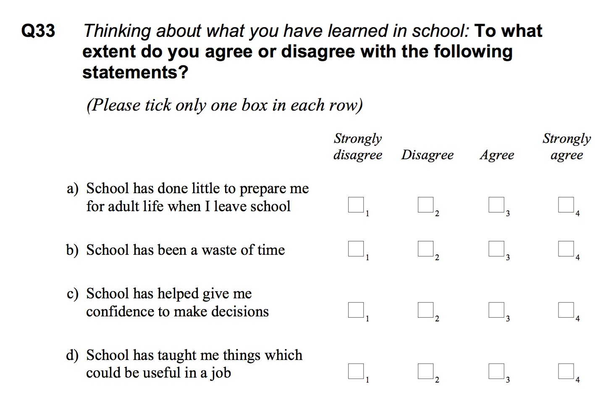
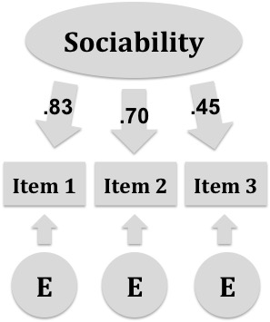

# Measurement, Scales, and Scoring {#measurement}

> Measurement is never better than the empirical operations by which it is carried out, and operations range from bad to good.  
> --- Stanley Stevens, *On the Theory of Scales of Measurement*

The [Preface](#preface) to this book introduced a few perspectives on testing, with an emphasis on validity as a measure of the effectiveness of test scores. Validity is an overarching issue that encompasses all stages in the test development and administration processes, from blueprint to bubble sheet, including the stage wherein we choose the empirical operations that will assign numbers or labels to test takers based on their performance or responses.

In this chapter, we examine the measurement process at its most fundamental or basic level, the measurement level. We'll define three requirements for measurement, and consider the simplicity of physical measurement in comparison to the complexities of educational and psychological measurement where the thing we measure is often intractable and best represented using item sets and composite scores. Along the way, we'll describe a popular framework for distinguishing measurement scales, with examples from the PISA data set, and we'll look into why @stevens1946theory concluded that not all scales are created equal. Last are scoring and score referencing, including examples of norm and criterion referencing.

```{block, type="objectives"}
**Learning objectives**

1. Define the process of measurement.
2. Define the term *construct* and describe how constructs are used in measurement, with examples.
3. Compare and contrast measurement scales, including nominal, ordinal, interval, and ratio, with examples, and identify their use in context.
4. Compare and contrast dichotomous and polytomous scoring.
5. Describe how rating scales are used to create composite scores.
6. Explain the benefits of composites over component scores.
7. Create a generic measurement model and define its components.
8. Define norm referencing and identify contexts in which it is appropriate.
9. Compare three examples of norm referencing: grade, age, and percentile norms.
10. Define criterion referencing and identify contexts in which it is appropriate.
11. Describe how standards and performance levels are used in criterion referencing with standardized state tests.
12. Compare and contrast norm and criterion score referencing, and identify their uses in context.
```

In this chapter, we'll analyze and create plots with `PISA09` data using the epmr and ggplot2 packages. We'll also analyze some data on US states, contained within the datasets package automatically included with R.

```{r, append=TRUE, chap=2}
# R setup for this chapter
# Required packages are assumed to be installed,
# see chapter 1
library("epmr")
library("ggplot2")
# Functions we'll use in this chapter
# data(), class(), factor(), c(), from chapter 1
# head() to print the first six rows or values in an 
# object
# paste0() for pasting together text and using it to index
# a data set
# apply() for applying a function over rows or columns of 
# a data set
# tapply() for applying a function over groups
# dstudy() from the epmr package for getting descriptives
# ggplot(), aes(), and geom_boxplot() for plotting
# round(), nrow(), and with() for examining data
# We'll use a data set included in the base R packages 
# called state.x77
```

## What is measurement?

### How do we define it?

We usually define the term *measurement* as the assignment of values to objects according to some system of rules. This definition originates with @stevens1946theory, who presented what have become the four traditional scales or types of measurement. We'll talk about these shortly. For now, let's focus on the general measurement process, which involves giving an *object of measurement*, the person or thing for whom we're measuring, a value that represents something about it.

Measurement is happening all the time, all around us. Daily, we measure what we eat, where we go, and what we do. For example, drink sizes are measured using categories like tall, grande, and venti. A jog or a commute is measured in miles or kilometers. We measure the temperature of our homes, the air pressure in our tires, and the carbon dioxide in our atmosphere. The wearable technology you might have strapped to your wrist could be monitoring your lack of movement and decreasing heart rate as you doze off reading this sentence. After you wake up, you might check your watch and measure the length of your nap in minutes or hours.

These are all examples of physical measurement. In each example, you should be able to identify 1) the object of measurement, 2) the property or quality that's being measured for it, and 3) the kinds of values used to represent amounts of this property or quality. The property or quality that's being measured for an object is called the *variable*. The kinds of values we assign to an object, for example, grams or degrees Celsius or beats per minute, are referred to as the *units of measurement* that are captured within that variable.

Let's look at some examples of measurement from the `state` data sets in R. The object `state.x77` contains data on eight variables, with the fifty US states as the objects of measurement. For details on where the data come from, see the help file `?state`.

```{r, append=TRUE, chap=2}
# Load state data
data(state)
# Print first 6 rows, all columns
head(state.x77)
```

Take a minute to consider what the variables in `state.x77` are measuring, and what the units of measurement are for these variables. For example, `state.x77[, "Population"]` contains population estimates from 1975 for each state, expressed as thousands. So, `state.x77["Wisconsin", "Population"]` gives us `r state.x77["Wisconsin", "Population"]`, or a population of `r state.x77["Wisconsin", "Population"]` thousand people. What other variables from `state.x77` are measured as simple counts? To practice what you learned in Chapter \@ref(introduction), try to convert the illiteracy rates in `state.x77[, "Illiteracy"]` from proportions to counts *for each state*.

Note that `state.x77` is a matrix, which means we can't index columns using `$`. That only works with a `list` or `data.frame`. However, the rows and columns of a matrix can have names, accessed with `rownames()` and `colnames()`, and we can use these names to index the matrix, as shown above.

```{block, type="learning-check"}
**Learning check**: What are the objects of measurement and the units of measurement involved in measuring illiteracy rates, as contained in `state.x77[, "Illiteracy"]`?
```

### From physical to intangible

With most physical measurements, the property that we're trying to represent or capture with our values can be clearly defined and consistently measured. For example, amounts of food are commonly measured in grams. A cup of cola has about 44 grams of sugar in it. When you see that number printed on your can of soda pop or fizzy water, the meaning is pretty clear, and there's really no need to question if its accurate. Cola has a shocking amount of sugar in it.

But, just as often, we take a number like the amount of sugar in our food and use it to represent something abstract or intangible like how healthy or nutritious the food is. A food's healthiness isn't as easy to define as its mass or volume. A measurement of healthiness or nutritional value might account for the other ingredients in the food and how many calories they boil down to. Furthermore, different foods can be more or less nutritional for different people, depending on a variety of factors. Healthiness, unlike physical properties, is intangible and difficult to measure.

Most of the variables in `state.x77` are relatively easy to measure, as they involve observable quantities, such as numbers of dollars for `state.x77[, "Income"]`, years for `state.x77[, "Life Exp"]`, and days for `state.x77[, "Frost"]`. On the other hand, illiteracy rates are not as easily measured. A variable such as illiteracy is not countable or directly observable, which makes it subject to measurement error.

The social sciences of education and psychology typically focus on the measurement of *constructs*, intangible and unobservable qualities, attributes, or traits that we assume are causing certain observable behavior or responses. In this book, our objects of measurement are typically people, and our goal is to give these people numbers or labels that tell us something meaningful about constructs such as their intelligence, reading ability, or social anxiety. Constructs like these are difficult to measure. That's why we need an entire book to discuss how to best measure them.

A good question to ask at this point is, how can we measure and provide values for something that's unobservable? How do we score a person's math ability if we can't observe it directly? The approach commonly taken is to identify an *operationalization* of our construct, an observable behavior or response that increases or decreases, we assume, as a person moves up or down on the construct. With math ability, that operationalization might be the number of math questions a person answers correctly out of 20. With social anxiety, it might be the frequency of feeling anxious over a given period of time. With illiteracy, the operationalization might be the number of words read correctly from a passage of text. Or it could be a simple "yes" or "no," in response to the question, "Can you read?"

When using a proxy for our construct, we *infer* that the operationalization we're actually observing and measuring accurately represents the underlying quality or property that we're interested in. This inference, which some consider to be unfounded [e.g., @michell2000normal], brings us to the overarching question addressed in this book.

### What makes measurement good?

In the last year of my undergraduate work in psychology I conducted a research study on the constructs of aggression, sociability, and victimization with Italian preschoolers [@nelson2010italian]. I spent about four weeks collecting data in preschools. Data collection involved covering a large piece of cardboard with pictures of all the children in a classroom, and then asking each child, individually, questions about their peers.

To measure sociability, we asked three simple questions:  
  
* Who is fun to talk to?  
* Who is fun to do pretend things with?  
* Who has many friends?  
  
Kids with lots of peer nominations on these questions received a higher score, indicating that they were more sociable. After asking these and other questions to about 300 preschoolers, and then tallying up the scores, I wondered how well we were actually measuring the constructs we were targeting. Were these scores any good? Was three or five questions enough? Maybe we were missing something important? Maybe some of these questions, which had to be translated from English into Italian, meant different things on the coast of the Mediterranean than they did in the Midwest US?

This project was my first experience on the measuring side of measurement, and it fascinated me. The questions that I asked then are the same questions that we'll ask and answer in this book. How consistently and accurately are we measuring what we intend to measure? What can we do to improve our measurement? And how can we identify instruments that are better or worse than others? These questions all have to do with what makes measurement good.

Many different things make measurement good, from writing high-quality items to adherence to established test development guidelines. For the most part, the resulting scores are considered good, or effective, when they consistently and accurately describe a target construct. Consistency and accuracy refer to the *reliability* and *validity* of test scores, that is, the extent to which the same scores would be obtained across repeated administrations of a test, and the extent to which scores fully represent the construct they are intended to measure.

These two terms, reliability and validity, will come up many times throughout the book. The second one, validity, will help us clarify our definition of measurement in terms of its purpose. Of all the considerations that make for effective measurement, the first to address is purpose.

### What is the purpose?

Measurement is useless unless it is based on a clearly articulated purpose. This purpose describes the goals of administering a test or survey, including what will be measured, for whom, and why? We've already established the "what?" as the variable or construct, the property, quality, attribute, or trait that our numbers or values represent. We've also established the "for whom?" as the object, in our case, people, but more specifically perhaps students, patients, or employees. Now we need to establish the "why?"

The purpose of a test specifies its intended application and use. It addresses how scores from the test are designed to be interpreted. A test without a clear purpose can't be effective.

The simple sociability assessment described above was intended to support research on this and related constructs, such as aggression, that are relevant to teaching and learning within the preschool classroom. This stated purpose suggests that the measure itself should contain items or tasks that are worded simply and in a way that preschoolers will understand. It also suggests that the content should be relevant to the classroom environment, where children are interacting with peers, rather than other environments where sociability may be observed, such as in the home.

Suppose someone asks you to create a measure of students' financial savvy, that is, their understanding of money and how it is used in finance. You've got here a simple construct, understanding of finance, and the object of measurement, students. But before you can develop this test you'd need to know how it is going to be used. Its purpose will determine key features like what specific content the test contains, the level of difficulty of the questions, the types of questions used, and how it is administered. If the test is used as a final exam in a finance course, it should capture the content of that course, and it might be pretty rigorous. On the other hand, if it's used with the general student body to see what students know about balancing budgets and managing student loans, the content and difficulty might change. Clearly, you can't develop a test without knowing its purpose. Furthermore, a test designed for one purpose may not function well for another.

```{block, type="learning-check"}
**Learning check**: Take a minute to think about some of the tests you've used or taken in the past. How would you express the purposes of these tests? When answering this question, be careful to avoid simply saying that the purpose of the test is to measure something.
```

A statement of test purpose should clarify what can be done with the resulting scores. For example, scores from placement tests are used to determine what courses a student should take or identify students in need of certain instructional resources. Scores on admissions tests inform the selection of applicants for entrance to a college or university. Scores on certification and licensure exams are used to verify that examinees have the knowledge, skills, and abilities required for practice in a given profession. Table \@ref(tab:testpurposes) includes these and a few more examples. In each case, scores are intended to be used in a specific way.

```{r testpurposes, echo=FALSE}
knitr::kable(cbind("Test Type" = c("Accountability", "Admissions", "Employment", "Exit Testing", "Licensing", "Placement"), "Intended Use" = c("Hold various people responsible for student learning", "Selection for entrance to an educational institution", "Help in hiring and promotion of employees", "Check for mastery of content required for graduation", "Verify that candidates are fit for practice", "Selecting coursework or instructional needs")),
  digits = 2, caption = "Intended Uses for Some Common Types of Standardized Tests")
```

Here's one more example. Some of my research is based on a type of standardized placement testing that is used to measure student growth over a short period of time. In addition to measuring growth, scores are also used to evaluate the effectiveness of intervention programs, where effective interventions lead to positive results for students. My latest project in this area of assessment involved measures of early literacy called IGDIs [@bradfield2014redefining]. A brochure for the measures from [www.myigdis.com](http://www.myigdis.com) states,

> myIGDIs are a comprehensive set of assessments for monitoring the growth and development of young children. myIGDIs are easy to collect, sensitive to small changes in children's achievement, and mark progress toward a long-term desired outcome. For these reasons, myIGDIs are an excellent choice for monitoring English Language Learners and making more informed Special Education evaluations.

This summary contains specific claims regarding score use, including monitoring growth, and sensitivity to small changes in achievement. Validity evidence is needed to demonstrate that scores can effectively be used in these ways.

The point of these examples is simply to clarify what goes into a statement of purpose, and why a well articulated purpose is an essential first step to measurement. We'll come back to validation of test purpose in Chapter \@ref(validity). For now, you just need to be familiar with how a test purpose is phrased and why it's important.

### Summary

To summarize this section, the measurement process allows us to capture information about individuals that can be used to describe their standing on a variety of constructs, from educational ones, like math ability and vocabulary knowledge, to psychological ones, like sociability and aggression. We measure these properties by operationalizing our construct, for example, in terms of the number of items answered correctly or the number of times individuals exhibit a certain behavior. These operational variables are then assumed to represent our construct of interest. Finally, our measures of these constructs can then be used for specific purposes, such as to inform research questions about the relationship between sociability and aggression, or to measure growth in early literacy.

So, measurement involves a construct that we don't directly observe and an operationalization of it that we do observe. Our measurement is said to be effective when there is a strong connection between the two, which is best obtained when our measurement has a clear purpose. In the next two sections, on measurement scales and scoring, we'll focus on how to handle the operational side of measurement. Then, with measurement models, we'll consider the construct side. Finally, in the section on score referencing, we'll talk about additional labels that we use to give meaning to our scores.

## Measurement scales

Now that we've established what measurement is, and some key features that make the measurement process good, we can get into the details of how measurement is carried out. As defined by @stevens1946theory, measurement involves the assignment of values to objects according to certain rules. The rules that guide the measurement process determine the type of measurement scale that is produced and the statistics that can be used with that scale.

Measurement scales are grouped into four different types. These differ in the meaning that is given to the values that are assigned, and the relationship between these values for a given variable.

### Nominal

The most basic measurement scale is really the absence of a scale, because the values used are simple categories or names, rather than quantities of a variable. For this reason it is referred to as a *nominal scale*, where our objects of measurement are grouped qualitatively, for example by gender or political party. The nominal scale can also represent variables such as zip code or eye color, where multiple categories are present. So, identifying (ID) variables such as student last name or school ID are also considered nominal.

Only frequencies, proportions, and percentages (and related nonparametric statistics) are permitted with nominal variables. Means and standard deviations (and related parametric statistics) do not work. It would be meaningless to calculate something like an average gender or eye color, because nominal variables lack any inherent ordering or quantity in their values.

What variables from `PISA09` would be considered nominal? Nominal variables often have a specific class in R, which you can check with `class()`, as we did in Chapter \@ref(introduction). The `class` of an R object doesn't map directly to its measurement scale, but it can provide helpful information about features of the scale. `mode()` can also be informative regarding how a variable is measured.

Nominal variables are often coded in R using text strings. Our `classroom` variable from Chapter \@ref(introduction) is an example. After converting this character object to the factor class, R identifies each unique value within the object as a level, or unit of measurement. Other functions in R will then be able to recognize the object as a factor, and will interpret its contents differently. To see this interpretation in action, try to calculate the mean of our classroom variable, or any of the nominal variables in `PISA09`, and you'll receive a warning from R.

```{r, append=TRUE, chap=2}
# Comparing two classifications of nominal variables in R
# Nominal classroom labels as character
roomnumber <- c("1", "2", "3", "1", "2", "3")
class(roomnumber)
# Nominal classroom labels as factor
roomnumber <- factor(roomnumber)
class(roomnumber)
```

### Ordinal

The dominant feature of the *ordinal scale* is order, where values do have an inherent ordering that cannot be removed without losing meaning. Common examples of ordinal scales include ranks (e.g., first, second, third, etc.), the multi-point rating scales seen in surveys (e.g., strongly disagree, disagree, etc.), and level of educational attainment.

The distance between the ordered categories in ordinal scale variables (i.e., the interval) is never established. So, the difference between first and second place does not necessarily mean the same thing as the difference between second and third. In a swimming race, first and second might differ by a matter of milliseconds, whereas second and third differ by minutes. We know that first is faster than second, and second is faster than third, but we don't know *how much* faster. Note that the construct we're measuring here is probably swimming ability, which is actually operationalized on a ratio scale, in terms of speed, but it is simplified to an ordinal scale when giving out awards.

What variables in `PISA09` are measured on ordinal scales? To identify a variable as being measured on an ordinal scale, we really need to know how data were collected for the variable, and what the scale values are intended to represent. Whereas the choice of nominal is relatively simple, the choice of ordinal over interval or ratio is often requires a judgement call, as discussed below.

In theory, statistics which rely on interval level information, such as the mean, standard deviation, and all mean-based statistical tests, are still not allowed with an ordinal scale. Statistics permitted with ordinal variables include the median and any other statistics based on percentiles.

### Interval

Interval scales include ordered values where the distances, or intervals, between them are meaningful. Whereas an ordinal scale describes one category only as greater than, less than, or equal to another, with an interval scale the difference between categories is quantified in scale points that have a consistent meaning across the scale. With interval scales we can finally use means, standard deviations, and related parametric statistical tests.

One common example of an interval scale is test score based on number correct, where each item in a test is worth the same amount when calculating the total. When treating test scores as interval variables, we make the assumption that a difference in score points reflects a consistent difference in the construct no matter where we are on the scale. This can sometimes be problematic. A test of vocabulary could be measured on an interval scale, where each correctly defined word contributes the same amount to the total score. However, in this case we assume that each correct definition is based on the same amount of construct, vocabulary knowledge. That is, the vocabulary words need to be similar in difficulty for the students we're testing. Otherwise, scale intervals will not have a consistent meaning. Instead, an increase in number correct will depend on the word that is answered correctly. Item response theory, described in Chapter \@ref(irt), seeks to address this issue.

Another common example of an interval scale is temperature as measured in degrees centigrade or Fahrenheit. These temperature scales both have meaningful intervals, where a given increase in heat, for example, produces the same increase in degrees no matter where you are on the scale. However, a zero on the Fahrenheit or centigrade scales does not indicate an absence of the variable we are measuring, temperature. This is the key distinction between an interval and a ratio scale.

### Ratio

The ratio scale is an interval scale with a meaningful absolute zero, or a point at which there is an absence of the variable measured. Whereas an interval scale describes differences between scale values in scale points, a ratio scale can compare values by ratios. A simple example is time, where 1 hour is equivalent to 2/3 hours + 1/3 hours. Other examples include counts of observations or occurrences, such as the number of aggressive or prosocial behaviors per hour, or the frequency of drug use in the past month.

Note that we often reference ratio scales when operationalizing constructs, in which case we may lose our meaningful zero point. For example, zero prosocial behaviors does in fact indicate that nothing noticeably prosocial occurred for a student over a certain period of time. However, this may not mean that a student is completely void of prosociability. In the same way, zero aggressive behaviors does not necessarily indicate an absence of aggression. Thus, when a ratio variable is used to operationalize a construct, it may necessarily lose its ratio properties.

All statistics are permitted with ratio scales, though the only ones we talk about, in addition to those available with interval scales, are statistics that let you make comparisons in scores using ratios. For example, a two hour test is twice as long as a one hour test, and five aggressive episodes is half as many as ten. However, as before, if our scale is assumed to reference some underlying construct, five aggressive episodes may not indicate twice as much aggression as ten.

### Comparing scales

Progressing from nominal to ratio, the measurement scales become more descriptive of the variable they represent, and more statistical options become available. So, in general, the further from a nominal scale the better, as once a variable is measured its scale can only be downgraded. Consider the variable *age*, which could be represented in the following four ways:

1. number of days spent living, from 0 to infinity;
2. day born within a given year, from 1 to 365;
3. degree of youngness, including toddler, adolescent, adult, etc.; or
4. type of youngness, such as the same as Sam, or the same as Pat.

The first of these four, a ratio scale, is the most versatile and can be converted into any of the scales below it. However, once age is defined based on a classification, such as "same as Mike," no improvement can be made. For this reason a variable's measurement scale should be considered in the planning stages of test design, ideally when we identify the purpose of our test.

```{r, append=TRUE, chap=2}
# A demonstration of degrading a measurement scale
# from ratio down to nominal in R
c(sam = 12, pat = 18, gustav = 12, fran = 18)
c(37.83, 20.5, 1.17, 61.42, 8.75)
c(37.83, 20.5, 1.17, 61.42, 8.75)
c(37.83, 20.5, 1.17, 61.42, 8.75)
```

In the social sciences, measurement with the ratio scale is difficult to achieve because our operationalizations of constructs typically don't have meaningful zeros. So, interval scales are considered optimal, though they too are not easily obtained. Consider the sociability measure described above. What type of scale is captured by this measure? Does a zero score indicate a total absence of sociability? This is required for ratio. Does an incremental increase at one end of the scale mean the same thing as an incremental increase at the other end of the scale? This is required for interval.

Upon close examination, it is difficult to measure sociability, and most other constructs in the social sciences, with anything more than an ordinal scale. Unfortunately, an interval or ratio scale is required for the majority of statistics that we'd like to use. Along these lines, @stevens1946theory concluded:

> Most of the scales used widely and effectively by psychologists are ordinal scales. In the strictest propriety the ordinary statistics involving means and standard deviations ought not to be used with these scales, for these statistics imply a knowledge of something more than the relative rank-order of data. On the other hand, for this "illegal" statisticizing there can be invoked a kind of pragmatic sanction: In numerous instances it leads to fruitful results. While the outlawing of this procedure would probably serve no good purpose, it is proper to point out that means and standard deviations computed on an ordinal scale are in error to the extent that the successive intervals on the scale are unequal in size. When only the rank-order of data is known, we should proceed cautiously with our statistics, and especially with the conclusions we draw from them. [p. 679]

Based on this argument, a mean sociability score is only as useful as the scale itself is interval. The less meaningful the intervals between sociability scores, the less meaningful our mean estimate will be. Thus, when designing an instrument, we need to be aware of this limitation, and do our best to improve the intervalness of our scales. When stating the purpose of a test, we need to be aware of how our construct and operationalization of it will impact our resulting scale. Finally, we need to acknowledge the limitations of our scales, especially when utilizing potentially incorrect statistics.

Let's look at the `PISA09` reading scores as a final example. All of the scored item responses in `PISA09` have only two possible values, 0 and 1, representing incorrect and correct responses. These scored item responses could all be considered at least on ordinal scales, as 1 represents more of the measured construct than 0. The total score across all reading items could also be considered at least ordinal.

```{r, append=TRUE, chap=2}
# Names of all reading items, to be used as an indexing 
# object
ritems <- c("r414q02", "r414q11", "r414q06", "r414q09",
  "r452q03", "r452q04", "r452q06", "r452q07", "r458q01", 
  "r458q07", "r458q04")
# Paste an "s"" to the end of each name, for scored items
rsitems <- paste0(ritems, "s")
# apply() applies to a data set (the first argument) 
# across either
# rows or columns (the second argument) the function named
# (in the third argument). See also rowSums(). Here, we 
# treat missings as 0s, by excluding them from the sum.
PISA09$rtotal <- apply(PISA09[, rsitems], 1, sum,
  na.rm = TRUE)
dstudy(PISA09$rtotal)
```

The challenge in identifying a measurement scale is interpreting the meaningfulness of the intervals between scale values, for an interval scale, and the meaningfulness of a zero value, for a ratio scale. Do increments in the total reading score have a consistent meaning, relative to the construct of reading ability, across the scale? The answer depends on our interpretation of the items themselves and the mechanisms used to score them.

```{r qplot-rtotal, append=TRUE, chap=2, fig.asp='.5', out.width='75%', fig.cap="A bar plot of total scores on PISA09 scored reading items."}
# Bar plot of reading totals, which are, ironically, 
# converted to a factor before plotting, so ggplot treats 
# them as a discrete
# scale rather than continuous. Continuous defaults to a 
# histogram which isn't as useful.
ggplot(PISA09, aes(factor(rtotal))) + geom_bar()
```

When we talk about measurement scales, and next scoring, keep in mind that we're focusing on the x-axis of a plot like the one shown in Figure \@ref(fig:qplot-rtotal). The distribution itself doesn't necessarily help us interpret the measurement scale or scoring process. Instead, we're examining how individual items and combinations of them capture differences in the underlying construct.

```{block, type="learning-check"}
**Learning check**: Suppose the construct of aggression is measured with a group of students based on the number of aggressive behaviors observed during a class period. Why would an interval scale be more appropriate here than a ratio scale?
```

## Scoring

This book focuses on cognitive and noncognitive, that is, affective, test scores as operationalizations of constructs in education and psychology. As noted above, these test scores often produce ordinal scales with some amount of meaning in their intervals. The particular rules for assigning values within these scales depend on the type of scoring mechanisms used. Here, we'll cover the two most common scoring mechanisms or rules, dichotomous and polytomous scoring, and we'll discuss how these are used to create rating scales and composite scores.

### Dichotomous scoring

Dichotomous scoring refers to the assignment of one of two possible values based on a person's performance or response to a test question. A simple example is the use of correct and incorrect to score a cognitive item response. These values are mutually exclusive, and describe the correctness of a response in the simplest terms possible, as completely incorrect or completely correct.

Multiple-choice questions, discussed further in Chapter \@ref(development), are usually scored dichotomously. Most cognitive tests involve at least some dichotomously scored items. The PISA 2009 study implemented both dichotomously and polytomously scored items. However, all of the reading items in `PISA09` are dichotomously scored.

```{r, append=TRUE, chap=2}
# The apply() function again, used to iterate through 
# reading items, and for each column (hence the 2), run a 
# frequency table.
# Then, divide the result by the number of students, and 
# round to 2 decimal places.
rtab <- apply(PISA09[, rsitems], 2, table)
round(rtab / nrow(PISA09), 2)
```

Dichotomous scoring is also used in affective measures, such as attitude surveys, behavior checklists, and personality tests. The most common example is scoring that represents a response of either "yes" or "no." Statements are written to capture some feature of the construct, such as adventurousness, and individuals then indicate whether or not the statements are characteristic of them.

> I would enjoy being a bounty hunter.  
> * No  
> * Yes  

Alternatively, measures like the Myers-Briggs Type Indicator [MBTI; @myers1998manual], discussed further in Chapter \@ref(development), present a dichotomous choice in the form of sentence completion. One option must then be *keyed* to indicate a higher score on the construct being measured.

> I would prefer to hunt bounties  
> * Alone  
> * In a group  

If "alone" were keyed positively, and "in a group" were keyed zero, how would you describe the construct that it measures? What if "in a group" were scored positively, and "alone" negatively?

### Polytomous scoring

Polytomous scoring simply refers to the assignment of three or more possible values for a given test question or item. In cognitive testing, a simple example is the use of rating scales to score written responses such as essays. In this case, score values may still describe the correctness of a response, but with differing levels of correctness, for example, incorrect, partially correct, and fully correct.

Polytomous scoring with cognitive tests can be less straightforward and less objective than dichotomous scoring, primarily because it usually requires the use of human raters with whom it is difficult to maintain consistent meaning of assigned categories such as partially correct. The issue of interrater reliability will be discussed in Chapter \@ref(reliability).

Polytomous scoring with affective or non-cognitive measures most often occurs with the use of rating scales. For example, individuals may use a rating scale to describe how much they identify with a statement, or how well a statement represents them, rather than simply saying "yes" or "no." Such rating scales measure multiple levels of agreement (e.g., from disagree to agree) or preference (e.g., from dislike to like). In this case, because individuals provide their own responses, subjectivity in scoring is not an issue as it is with polytomous scoring in cognitive tests. Instead, the challenge with rating scales is in ensuring that individuals interpret the rating categories in the same way. For example, strongly disagree could mean different things to different people, which will impact how the resulting scores can be compared across individuals.

The student survey variables in `PISA09$st27q01` through `PISA09$st42q05` are polytomously scored rating scale items that contribute to four different composite scales. One of these scales measures students' attitude toward school, shown in Figure \@ref(fig:pisaq33).

```{r pisaq33, echo = FALSE, out.width='75%', fig.cap = "PISA 2009 student survey items measuring attitude toward school."}

```

Notice that the first two items in the scale are phrased negatively, and the second two are phrased positively. Items `PISA09$st33q01` and `PISA09$st33q02`, labeled a and b in Figure \@ref(fig:pisaq33), need to be reverse coded if we want higher scores to represent more positive attitude, as in c and d. `recode()` from the epmr package will automatically reverse score a numeric variable.

```{r, append=TRUE, chap=2}
# Reverse code two variables
PISA09$st33q01r <- recode(PISA09$st33q01)
PISA09$st33q02r <- recode(PISA09$st33q02)
```
```{r, echo=FALSE}
stitems <- c("st27q01", "st27q02", "st27q03", "st27q04", 
  "st27q05", "st27q06", "st27q07", "st27q08", "st27q09", 
  "st27q10", "st27q11", "st27q12", "st27q13", "st41q01", 
  "st41q02", "st41q03", "st41q04", "st41q05", "st41q06",
  "st42q01", "st42q02", "st42q03", "st42q04", "st42q05")
```

Having recoding the negatively worded attitude items, we can consider ways of combining information across all four items to get an overall measure for each student. Except in essay scoring and with some affective measures, an individual question is rarely used alone to measure a construct. Instead, scores from multiple items are combined to create composite scores or rating scale scores.

### Rating scales

When I was in graduate school, the professor for my introductory measurement class would chastise students when they referred to multipoint rating scales as "Likert scales." @likert1932technique did not invent the rating scale. Instead, he detailed two methods for combining scores across multiple rating scale items to create a composite score that would be, in theory, a stronger measure of the construct than any individual item. One of these methods, which has become a standard technique in affective measurement, is to assign ordinal numerical values to each rating scale category, and then calculate a sum or average across a set of these rating scale items.

The scaling technique demonstrated by @likert1932technique involves, first, the scoring of individual rating scale items using polytomous scales. For example, response options for one set of survey questions in @likert1932technique included five categories, ranging from strongly disapprove to undecided to strongly approve, similar to the PISA survey items. These categories were assigned score values of 1 through 5. Then, a total score was obtained across all items in the set. Low scores were interpreted as indicating strong disapproval and high scores were interpreted as indicating strong approval. This process could be referred to as Likert scaling. But in this book we'll simply refer to it as scaling, or creating a total or average score across multiple items.

```{r, append=TRUE, chap=2}
# Names of all attitude toward school items, to be used as
# an indexing object
# Note the added "r" in the names for the first two items,
# which were recoded
atsitems <- c("st33q01r", "st33q02r", "st33q03", 
  "st33q04")
# Calculate total scores again using apply(), and look at 
# descriptives
PISA09$atotal <- apply(PISA09[, atsitems], 1, sum,
  na.rm = TRUE)
dstudy(PISA09$atotal)
```

In Chapter \@ref(development) we will address rating scales in more detail. We'll cover issues in the construction and administration of rating categories. Here, we are more concerned with the benefits of using composite scale scores.

### Composites versus components

A composite score is simply the result of some combination of separate subscores, referred to as components. Thus far, we have created total scores in R. Most often, we will deal with either total scores or *factor scores* on a test, where individual items make up the components. Factor scores refer to scores obtained from some measurement model, such as a classical test theory model, discussed in Chapter \@ref(reliability), or an item response theory model, discussed in Chapter \@ref(irt). Factor analysis is covered in Chapter \@ref(dimensionality). We will also encounter composite scores based on totals and means from rating scale items. In each case, the composite is going to be preferable to any individual component for the following reasons.

Composite scores are preferable from a statistical standpoint because they tend to provide a more reliable and valid measure of our construct. Composites are more reliable and valid because they combine information from multiple smaller, repeated measures of the construct. These smaller components may each be limited in certain ways, or may only present a small piece of the big picture, and when combined, the resulting score is more *comprehensive* and more easily reproduced in subsequent measurements. In Chapter \@ref(reliability), we'll learn more about why reliability is expected to increase, in theory, as we increase the number of items in our composite.

For example, when measuring a construct such as attitude toward animal rights, a single item would only provide information about a specific instance of the issue. Consider the example survey items presented by @mathews1997personality\:

> The Animal Attitude Scale (AAS) assesses individual differences in attitudes toward the treatment of animals... It is composed of 29 items
which subjects rate on a five-point Likert scale (strongly agree to strongly disagree). Sample items include, "I do not think that there is anything wrong with using animals in medical research," "It is morally wrong to hunt wild animals just for sport," and "I would probably continue to use a product that I liked even though I know that its development caused pain to laboratory animals." [p. 171]

By themselves, any one of these items may not reflect the full construct that we are trying to measure. A person may strongly support animal rights, except in the case of medical research. Or a person may define the phrase "that I liked," from the third example question, in different ways so that this individual question would produce different results for people who might actually be similar in their regard for animals. A composite score helps to average out the idiosyncracies of individual items. (Side note from this study: a regression model showed that 25% of the variance in attitude toward animals was accounted for by gender and a personality measure of sensitivity.)

```{block, type="learning-check"}
**Learning check**: Suppose a composite score is calculated based on total scores across the 29 AAS items. What type of scoring would first need to take place with the items themselves? What would be the range for total scores?
```

The simpler methods for creating composites, by averaging and totaling across items, are used with smaller-scale instruments to facilitate scoring and score reporting. A major drawback to simple averages and totals is the lack of interval properties in the resulting scales. Another drawback is the presence of measurement error, or random noise, within average or total scores. To avoid these and other drawbacks, many instruments, including large-scale educational tests and psychological measures, are scaled using measurement models.

## Measurement models

Whereas a simple sum or average over a set of items lets each item contribute the same amount to the overall score, more complex measurement models can be used to estimate the different contributions of individual items to the underlying construct. These contributions can be examined in a variety of ways, as discussed in Chapters \@ref(reliability), \@ref(irt), and \@ref(dimensionality). Together, they can provide useful information about the quality of a measure, as they help us understand the relationship between our operationalization of the construct, in terms of individual items, and the construct itself.

Measurement models represent an unobservable construct by formally incorporating a measurement theory into the measurement process. We will review two formal measurement theories in this book. The first is called classical test theory, presented in Chapter \@ref(reliability), and the second is item response theory, presented in Chapter \@ref(irt) [for a comparison, see @hambleton1993comparison]. For now, we'll just look at the basics of what a measurement model does.

Figure \@ref(fig:simple-model) contains a visual representation of a simple measurement model where the underlying construct of sociability, shown in an oval, causes, in part, the observed responses in a set of three questions, shown in rectangles as Item 1, Item 2, and Item 3. Unobservable quantities in a measurement model are typically represented by ovals, and observable quantities by rectangles. Causation is then represented by the arrows which point from the construct to the item responses. The numbers over each arrow from the construct are the scaled factor loadings reported in @nelson2010italian, which represent the strength of the relationship between the items and the construct which they together define. As with a correlation coefficient, the larger the factor loading, the stronger the relationship. Thus, item 1 has the strongest relationship with the sociability factor, and item 3 has the weakest.

The other unobserved quantities in Figure \@ref(fig:simple-model) are the error terms, in the circles, which also impact responses on the three items. Without arrows linking the error terms from one to another, the model assumes that errors are independent and unrelated across items. In this case, any influence on a response that does not come from the common factor of sociability is attributed to measurement error.

```{r simple-model, echo = FALSE, out.width='25%', fig.cap = "A simple measurement model for sociability with three items, based on results from D. A. Nelson et al. (2010). Numbers are factor loadings and E represents unique item error."}

```

Note that the model in Figure \@ref(fig:simple-model) breaks down our observed variables, the scored item responses, into two unrelated sources of variability, one based on the commonly measured construct, and the other based on individual item errors. In theory, these errors are still present in our total scores, but they are extracted from the construct scores produced by a measurement model. Thus, measurement models provide a more reliable measure of the construct.

```{block, type="learning-check"}
**Learning check**: Describe the different parts of the sociability measurement model. What do the ovals, rectangles, and arrows represent?
```

Models such as the one in Figure \@ref(fig:simple-model) are referred to as confirmatory factor analysis models, because we propose a given structure for the relationships between constructs, error, and observations, and seek to confirm it by placing certain constraints on the relationships we estimate. In Chapter \@ref(dimensionality), we'll discuss these along with exploratory models where we aren't certain how many underlying constructs are causing responses.

## Score referencing

Now that we've discussed the measurement process we can go over some common methods for giving meaning to the scores that our measures produce. These methods are referred to as norm and criterion score referencing. Each is discussed briefly below, with examples.

### Norm referencing

Norm referencing gives meaning to scores by comparing them to values for a specific norm group. For example, when my kids bring home their standardized test results from school, their scores in each subject area, math and reading, are given meaning by comparing them to the distribution of scores for students across the state. A score of 22 means very little to a parent who does not have access to the test itself. However, a percentile score of 90 indicates that a student scored at or above 90% of the students in the norming group, regardless of what percentage of the test questions they answered correctly.

Norms are also frequently encountered in admissions testing. If you took something like the ACT or SAT, college admissions exams used in the US, or the GRE, an admissions test for graduate school, you're probably familiar with the ambiguous score scales these exams use in reporting. Each scale is based on a conversion of your actual test scores to a scale that is intentionally difficult or impossible to understand. In a way, the objective in this rescaling of scores is to force you to rely on the norm referencing provided in your score report. The ACT scales range from 1 to 36, but a score of 20 on the math section doesn't tell you a lot about how much math you know or can do. Instead, by referencing the published norms, a score of 20 tells you that you scored around the 50th percentile for all test takers.

The two examples above involve simple percentile norms, where scores are compared to the full score distribution for a given norm group. Two other common types of norm referencing are grade and age norms, which are obtained by estimating the typical or average performance on a test by grade level or age. For example, we can give meaning to `PISA09` reading scores by comparing them to the medians by grade.

```{r, append=TRUE, chap=2}
# tapply() is like apply() but instead of specifying rows
# or columns of a matrix, we provide an index variable.
# Here, median() will be applied over subsets of rtotal by
# grade. with() is used to subset only German students.
with(PISA09[PISA09$cnt == "DEU", ],
  tapply(rtotal, grade, median, na.rm = TRUE))
# Most German students are in 9th grade. Medians aren't as
# useful for grades 7, 11, and 12.
table(PISA09$grade[PISA09$cnt == "DEU"])
```

A reading score of 6, for example, would be given a grade norm of 9, as it exceeds the median score for 9th graders but not 10th graders. In practice, grade norms are reported using decimals that capture the month within the school year as well, For example, a 9.6 would indicate that a student's reading score is at the median performance of students in their sixth month of 9th grade. These normative scores by grade are referred to as grade equivalents. Age norms and age equivalents are calculated in the same way, but using age as the indexing variable.

Again, norms give meaning to a score by comparing it to the score distribution for a particular norming group. Box plots can be used to visualize a score distribution based on the 25th, 50th, and 75th percentiles, along with any outliers.

```{r boxplots-rtotal, append=TRUE, chap=2, out.width='75%', fig.cap="Bar plots of total scores on PISA09 scored reading items for Germany by grade."}
# Get box plots of reading total scores
ggplot(PISA09[PISA09$cnt == "DEU" & PISA09$grade %in% 
  8:10, ], aes(x = factor(grade), y = rtotal)) +
  geom_boxplot()
```

### Criterion referencing

The main limitation of norm referencing is that it only helps describe performance relative to other test takers. Criterion score referencing does the opposite. Criterion referencing gives meaning to scores by comparing them to values directly linked to the test content itself, regardless of how others perform on the content [@popham1969implications].

Educational tests supporting instructional decision making are often criterion referenced. For example, classroom assessments are used to identify course content that a student has and has not mastered, so that deficiencies can be addressed before moving forward. The vocabulary test mentioned above is one example. Others include tests used in student placement and exit testing.

Standardized state test results, which were presented above as an example of norm referencing, are also given meaning using some form of criterion referencing. The criteria in state tests are established, in part, by a panel of teachers and administrators who participate in what is referred to as a *standard setting*. State test standards are chosen to reflect different levels of mastery of the test content. In Nebraska, for example, two cut-off scores are chosen per test to categorize students as below the standards, meets the standards, and exceeds the standards. These categories are referred to as performance levels. Student performance can then be evaluated based on the description of typical performance for their level. Here is the performance level description for grade 5 science, meets the standard, as of 2014:

> Overall student performance in science reflects satisfactory performance on the standards and sufficient understanding of the content at fifth grade. A student scoring at the Meets the Standards level generally draws on a broad range of scientific knowledge and skills in the areas of inquiry, physical, life, and Earth/space sciences.

The Nebraska performance categories and descriptions are available online at [www.education.ne.gov/assessment](http://www.education.ne.gov/assessment). Performance level descriptions are accompanied by additional details about expected performance for students in this group on specific science concepts. Again for grade 5 science, meets the standard:

> A student at this level generally:  
> 1. Identifies testable questions,  
> 2. Identifies factors that may impact an investigation,  
> 3. Identifies appropriate selection and use of scientific equipment,  
> 4. Develops a reasonable explanation based on collected data,  
> 5. Describes the physical properties of matter and its changes.  

The performance levels and descriptors used in standardized state tests provide general information about how a test score relates to the content that the test is designed to measure. Given their generality, these results are of limited value to teachers and parents. Instead, performance level descriptors are used for accountability purposes, for example, to assess performance at the school, district, and even the state levels in terms of the numbers of students meeting expectations.

The Beck Depression Inventory [BDI; @beck1961inventory] is an example of criterion referencing in psychological testing. The BDI includes 21 items representing a range of depressive symptoms. Each item is scored polytomously from 0 to 3, and a total score is calculated across all of the items. Cutoff scores are then provided to identify individuals with minimal, mild, moderate, and severe depression, where lower scores indicate fewer depressive symptoms and higher scores indicate more severe depressive symptoms.

### Comparing referencing methods

Although norm and criterion referencing are presented here as two distinct methods of giving meaning to test scores, they can sometimes be interrelated and thus difficult to distinguish from one another. The myIGDI testing program described above is one example of score referencing that combines both norms and criteria. These assessments were developed for measuring growth in early literacy skills in preschool and kindergarten classrooms. Students with scores falling below a cut-off value are identified as potentially being at risk for future developmental delays in reading. The cut-off score is determined in part based on a certain percentage of the test content (criterion information) and in part using mean performance of students evaluated by their teachers as being at-risk (normative information).

Norm and criterion referencing serve different purposes. Norm referencing is typically associated with tests designed to rank order test takers and make decisions involving comparisons among individuals, whereas criterion referencing is associated with tests designed to measure learning or mastery and make decisions about individuals and programs [e.g., @bond1996norm; @popham1969implications]. These different emphases are relevant to the purpose of the test itself, and should be considered in the initial stages of test development, as discussed in Chapters \@ref(applications) and \@ref(development).

## Summary

This chapter provides an overview of what measurement is, how measurement is carried out in terms of scaling and scoring, and how measurement is given additional meaning through the use of score referencing and scale transformation. Before moving on to the next chapter, make sure you can respond to the learning objectives for this chapter, and complete the exercises below.

### Exercises

1. Teachers often use brief measures of oral reading fluency to see how many words students can read correctly from a passage of text in one minute. Describe how this variable could be modified to fit the four different scales of measurement.
2. Examine frequency distributions for each attitude toward school item, as was done with the reading items. Try converting counts to percentages.
3. Plot a histogram and describe the shape of the distribution of attitude toward school scores.
4. What country has the most positive attitude toward school?
5. Describe how both norm and criterion referencing could be helpful in an exam used to screen applicants for a job.
6. Describe how norm and criterion referencing could be used in evaluating variables outside the social sciences, for example, with the physical measurement applications presented at the beginning of the chapter.
7. Provide details about a measurement application that interests you.
    a. How would you label your construct? What terms can be used to define it?
    b. With whom would you measure this construct? Who is your object of measurement?
    c. What are the units of measurement? What values are used when assigning scores to people? What type of measurement scale will these values produce?
    d. What is the purpose in measuring your construct? How will scores be used?
    e. How is your construct commonly measured? Are there existing measures that would suit your needs?
    If you're struggling to find a measurement application that interests you, you can start with the construct addressed in this book. As a measurement student, you possess an underlying construct that will hopefully increase as you read, study, practice, and contribute to discussions and assignments. This construct could be labeled *assessment literacy* [@stiggins1991assessment].
