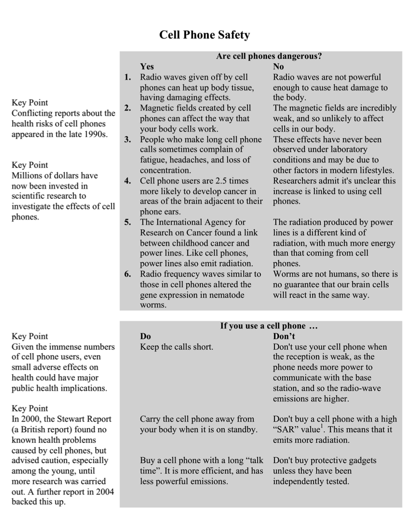
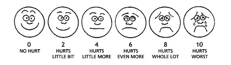

# Test Development {#development}

> A careful review of any testing program will identify poorly worded test items, written by persons with minimal training and inadequate insights into their audience. We need to do much more work to produce quality test items.  
> --- Mark Reckase, *2009 NCME Presidential Address*

Good items are the building blocks of good tests, and the validity of test scores can hinge on the quality of individual test items. Unfortunately, test makers, both in low-stakes and high-stakes settings, often presume that good items are easy to come by. As noted above, item writing is often not given the attention it deserves. Research shows that effective item writing is a challenging process, and even the highest-stakes of tests include poorly written items [@haladyna2013developing].

This chapter summarizes the main stages of both cognitive and noncognitive test construction, from conception to development, and the main features of commonly used item formats. Cognitive test development is covered first. The cognitive item writing guidelines presented in @haladyna2002review are summarized, along with the main concepts from the style guides used by testing companies. Next, noncognitive personality test development is discussed. Noncognitive item writing guidelines are reviewed, along with strategies for reducing the impact of response sets.

```{block, type="objectives"}
**Learning objectives**

*Cognitive*

1. Describe the purpose of a cognitive learning objective or learning outcome statement, and demonstrate the effective use of learning objectives in the item writing process.
2. Describe how a test outline or test plan is used in cognitive test development to align the test to the content domain and learning objectives.
3. Compare items assessing different cognitive levels or depth of knowledge, for example, higher-order thinking such as synthesizing and evaluating information versus lower-order thinking such as recall and definitional knowledge.
4. Identify and provide examples of SR item types (multiple-choice, true/false, matching) and CR item types (short-answer, essay).
5. Compare and contrast SR and CR item types, describing the benefits and limitations of each type.
6. Identify the main theme addressed in the item writing guidelines, and how each guideline supports this theme.
7. Create and use a scoring rubric to evaluate answers to a CR question.
8. Write and critique cognitive test items that match given learning objectives and depths of knowledge and that follow the item writing guidelines.

*Noncognitive*

9. Define affective measurement and contrast it with cognitive measurement in terms of applications and purposes, the types of constructs assessed, and the test construction process.
10. Compare affective test construction strategies, with examples of their use, and the strengths and limitations of each.
11. Compare and contrast item types and response types used in affective measurement, describing the benefits and limitations of each type, and demonstrating their use.
12. Define the main affective response sets, and demonstrate strategies for reducing their effects.
13. Write and critique effective affective items using empirical guidelines.
```

## Validity and test purpose

As is the case throughout this book, we will begin this chapter on test development with a review of validity and test purpose. Recall from Chapters \@ref(introduction) through \@ref(applications) that validity refers to the degree to which evidence and theory support the interpretations of test scores entailed by the proposed uses of a test. In other words, validity indexes the extent to which test scores can be used for their intended purpose. These are generic definitions of validity that apply to any type of educational or psychological measure.

In this chapter we focus first on cognitive tests, where the purpose of the test is to produce scores that can inform decision making in terms of aptitude and achievement, presumably of students. So, we need to define validity in terms of these more specific test uses. Let's use a midterm exam from an introductory measurement course as an example. We could say that validity refers to the degree to which the content coverage of the exam (as specified in the outline, based on the learning objectives) supports the use of scores as a measure of student learning for topics covered in the first part of the course. Based on this definition of validity, what would you say is the purpose of the exam? Note how test purpose and validity are closely linked.

Construction of a valid test begins with a test purpose. You need to be able to identify the three components of a test purpose, both when presented with a well defined purpose, and when presented with a general description of a test. Later in the course you'll be reviewing information from test reviews and technical documentation which may or may not include clear definitions of test purpose. You'll have to take the available information and identify, to the best of your ability, what the test purpose is. Here are some verbs to look for: assess, test, and measure (obviously), but also describe, select, identify, examine, and gauge, to name a few.

Do your best to distill the lengthy description below into a one-sentence test purpose. This should be pretty straightforward. The information is all there. This description comes from the technical manual for the 2011 California Standards Test, which is part of what was formerly known as the Standardized Testing and Reporting (STAR) program for the state of California (see [www.cde.ca.gov](http://www.cde.ca.gov/)). These are more recent forms of the state tests that I took in school in the 1980s.

> California Standards Tests (CSTs) are produced for California public schools to assess the California content standards for ELA, mathematics, history/social science, and science in grades two through eleven.  
> A total of 38 CSTs form the cornerstone of the STAR program. The CSTs, given in English, are designed to show how well students in grades two through eleven are performing with respect to California's content standards. These standards describe what students should know and be able to do at each grade level in selected content areas.  
> CSTs carry the most weight in school and district Academic Performance Index (API) calculations. In addition, the CSTs for ELA and mathematics (grades two through eight) are used in determining Adequate Yearly Progress (AYP), which is used to meet the requirement of the federal Elementary and Secondary Education Act (ESEA) that all students score at the proficient level or above by 2014.

You should have come up with something like this for the CST test purpose: the CST measures ELA, mathematics, history/social science, and science for students in grades two through eleven to show how well they are performing with respect to California's content standards, and to help determine AYP.

## Learning objectives

To keep the description of the CSTs brief, I omitted details about the content standards. California, like all other states, has detailed standards or *learning objectives* defining what content/skills/knowledge/information/etc. must be covered by schools in the core subject areas. The standards specify what a student should know and be able to do after their educational experience. They establish the overarching goals for teaching and learning. Teachers, schools, and districts, to some extent, are then free to determine the best way to teach the standards.

In this chapter, educational standards are presented as a form of learning objective, which identify the goals or purposes of instruction. Here's a simplified example of a learning objective for this chapter: write and critique test items. This objective is extremely simple and brief. Can you describe why it would be challenging to assess proficiency or competency for this objective? How could the objective be changed to make it easier to assess?

Learning objectives that are broadly or vaguely defined lead to low-quality, unfocused test questions. The simple item-writing objective above does not include any qualifiers specifying how it is achieved or obtained or appropriately demonstrated. In state education systems, the standards are very detailed. For example, Nebraska defines more than 75 science standards in grade 11 alone (for details, see [www.education.ne.gov/academicstandards](http://www.education.ne.gov/academicstandards/)). From the Nebraska State Standards, Grade 11 Abilities to do Scientific Inquiry:

> 1. Design and conduct investigations that lead to the use of logic and evidence in the formulation of scientific explanations and models.  
> 2. Formulate a testable hypothesis supported by prior knowledge to guide an investigation.  
> 3. Design and conduct logical and sequential scientific investigations with repeated trials and apply findings to new investigations.

Note that these standards reflect specific things students should be able to do, and some conditions for how students can do these things well. Such specific wording greatly simplifies the item writing process because it clarifies precisely the knowledge, skills, and abilities that should be measured.

Notice also that the simplest way to assess the first science objective listed above would be to simply ask students to design and conduct an investigation that leads to the use of logic and evidence in the formulation of scientific explanations and models. The standard itself is almost worded as a test question. This is often the case with well-written standards. Unfortunately, the standardized testing process includes constraints, like time limits, that make it difficult or impossible to assess standards so directly. Designing and conducting an experiment requires time and resources. Instead, in a test we might refer students to an example of an experiment and ask them to identify correct or incorrect procedures, or we might ask students to use logic when making conclusions from given experimental results. In this way, we use individual test questions to indirectly assess different components of a given standard.

## Features of cognitive items

### Depth of knowledge

In addition to being written to specific standards or learning objectives, cognitive test items are also written to assess at a specific depth of knowledge (DOK). The DOK of an item indicates its level of complexity in terms of the knowledge and skills required to obtain a correct response. @bloom1956taxonomy presented the original framework for categorizing depth of knowledge in cognitive assessments. However, the majority of achievement tests nowadays use some version of the DOK categories presented by @webb2002depth. These DOK differ somewhat by content area, but are roughly defined in levels of increasing complexity as 1) recall and reproduction, 2) skills and concepts, 3) strategic thinking, and 4) extended thinking.

These simple DOK categories can be modified to meet the needs of a particular testing program. For example, here is the description of Level 1 DOK used in writing items for the standardized science tests in Nebraska:

> *Level 1 Recall and Reproduction* requires recall of information, such as a fact, definition, term, or a simple procedure, as well as performing a simple science process or procedure. Level 1 only requires students to demonstrate a rote response, use a well-known formula, follow a set procedure (like a recipe), or perform a clearly defined series of steps. A "simple" procedure is well-defined and typically involves only one-step.  
> Verbs such as "identify," "recall," "recognize," "use," "calculate," and "measure" generally represent cognitive work at the recall and reproduction level. Simple word problems that can be directly translated into and solved by a formula are considered Level 1. Verbs such as "describe" and "explain" could be classified at different DOK levels, depending on the complexity of what is to be described and explained.

DOK descriptions such as this are used to categorize items in the item writing process, and thereby ensure that the items together support the overall DOK required in the purpose of the test. Typically, higher DOK is preferable. However, lower levels of DOK are sometimes required to assess certain objectives, for example, ones that require students to recall or reproduce definitions, steps, procedures, or other key information. Furthermore, constraints on time and resources within the standardized testing process often make it impossible to assess the highest level of DOK, which requires extended thinking and complex cognitive demands.

### Item types

Cognitive test items come in a variety of types that differ in how material is presented to the test taker, and how responses are then collected. Most cognitive test questions begin with a *stem* or question statement. The stem should present all of the information needed to answer an item correctly. Optionally, an item, or a set of items, can refer to a figure, table, text, or other presentation of information that students must read, interpret, and sometimes interact with before responding. These are referred to as *prompts*, and they are typically presented separately from the item stem.

Selected-response (SR) items collect responses from test takers using two or more *response options*. The classic multiple-choice question is an SR item with a stem ending in a question or some direction that the test taker must choose one or more of options.

> In general, what is the optimal number of response options in a cognitive multiple-choice test question?  
> A. Two  
> B. Three  
> C. Four

Research shows that the optimal number of questions in a multiple-choice item is three [@rodriguez2005three]. Tradition leads many item-writers consistently to use four options. However, a feasible fourth option is often difficult to write, leading test takers to easily discount it, and thus making it unnecessary.

A variety of SR item types are available. More popular types include:

1. true/false, where test takers simply indicate whether a statement is true or false;
2. multiple correct or select all that apply, where more than one option can be selected as correct;
3. multiple true/false, a simplified form of multiple correct where options consist of binary factual statements (true/false) and are preceded by a prompt or question statement linking them together in some way;
4. matching, where test takers select for each option in one list the correct match from a second list;
5. complex multiple-choice, where different combinations of response options can be selected as correct, resembling a constrained form of multiple correct (e.g., options A and B, A and C, or all of the above); and
6. evidence-based, which can be any form of SR item where a follow-up question requires test takers to select an option justifying their response to the original item.

Evidence-based questions are becoming more popular in standardized achievement testing, as, test makers claim, they can be used to assess more complex reasoning. This is achieved via the nesting of content from one question inside the follow-up. Here's a simple evidence-based question on DOK.

> Part I. In a constructed-response science question, students are given a hypothesis and must then describe with an essay an experiment that could be used to test the hypothesis. In their description they must identify the key components of the experiment and justify the importance of each component in testing the hypothesis.  
> What depth of knowledge level does this science question assess?  
> A. 1  
> B. 2  
> C. 3  
> D. 4  

> Part II. What task from the science question in Part I best supports the answer for Part I?  
A. Describe an experiment.  
B. Identify the key components of an experiment.  
C. Justify the importance of each component.  

A constructed-response (CR) item does not present options to the test taker. As the name implies, a response must be constructed. Constructed-response items include short-answer, fill-in-the-blank, graphing, manipulation of information, and essays. Standardized performance assessments, for example, reading fluency measures, can also be considered CR tasks.

The science question itself within Part I of the evidence-based DOK item above is an example of a simple essay question. Note that this science question could easily be converted to a SR question with multiple correct answers, where various components of an experiment, some correct and some incorrect, could be presented to the student. Parts I and II from the evidence-based DOK question could also easily be converted to a single CR question, where test takers identify the correct DOK for the science question, and then provide their own supporting evidence.

There are some key advantages and disadvantages to multiple-choice or SR items and CR items. In terms of advantages, SR items are typically easy to administer and score, and are more objective and reliable than CR items. They are also more efficient, and can be used to cover more test content in a shorter period of time. Finally, SR items can provide useful diagnostic information about specific misconceptions that test takers might have.

Although they are more efficient and economical, SR items are more difficult to write well, they tend to focus on lower-order thinking and skills, such as recall and reproduction, and they are more susceptible to test-wiseness and guessing. Constructed-response items address each of these issues. They are easier to write, especially for higher-level thinking, and they eliminate the potential for simple guessing.

The main benefit of CR questions is they can be used to test more practical, authentic, and realistic forms of performance and tasks, including creative skills and abilities. The downside is that these types of performance and tasks require time to demonstrate and are then complex and costly to score.

### Performance assessment

CR items can be considered a subset of what is commonly referred to as performance assessment. Performance assessment focuses on the measurement of *processes and products*. Performance assessments require individuals to generate a response, demonstrate a skill, or perform a task. The key feature of a performance assessment is the requirement that an individual do something, i.e., perform in some way, to obtain a score.

In addition to CR items, some less common examples of performance assessment are objective structured clinical examinations (OSCE) and portfolio or body-of-work assessments. OSCE are often used in medical fields to assess a student's ability to perform certain tasks in a real-life scenario. For example, the real-life scenario might involve an actor pretending to have some ailment, and the student is rated on how well they respond in terms of their diagnosis and the treatment they prescribe. Portfolios often contain a sample of products that are used to represent an individual's accomplishments in a given field or area of expertise. For example, professors might be required to record publications, awards, and recognitions over the course of multiple years. The collection of work, as a portfolio, could then be used in an evaluation for promotion.

The GRE analytical writing section is a familiar form of performance assessment. This section of the GRE now includes two 30-minute essay questions. Below is an example of one essay prompt from the GRE website. The question is open-ended, requiring students to develop and support a position on the idea that reliance on technology will deteriorate our ability to think for ourselves.

> As people rely more and more on technology to solve problems, the ability of humans to think for themselves will surely deteriorate.  
> Discuss the extent to which you agree or disagree with the statement and explain your reasoning for the position you take. In developing and supporting your position, you should consider ways in which the statement might or might not hold true and explain how these considerations shape your position.

Take a minute to think about the construct that this question is intended to measure. "Analytical writing" is a good start, but you should try to be more specific. What knowledge, skills, and abilities are required to do well on the question? What are the benefits of performance assessments such as these?

As with CR items, the main benefit of performance assessment is that it is considered more authentic than traditional mastery assessment, because it allows us to assess directly what we're trying to measure. For example, the GRE essay question above measures the construct of analytical writing by asking examinees to write analytically. This improves the validity of the resulting score as an indicator of the construct itself. Performance assessments, because they require individuals to generate their own response, rather than select a response from a list of options, are also able to assess higher order thinking and skills like synthesis and evaluation. These skills are not easily assessed with simple selected-response questions.

Two of the drawbacks of performance assessments result from the fact that humans are involved in the scoring process. First, as noted above, performance assessments are less practical, because they require substantially more time and resources to develop and score. Second, the scoring process becomes subjective, to some extent. A third drawback to performance assessment is that content, though it may be assessed deeply, for example, using more depth of knowledge, it is not assessed broadly.

### Rubrics

Of these three drawbacks to performance assessment, subjectivity in scoring can be addressed so as to limit its negative effects. Subjectivity in scoring is reduced by using standardized scoring criteria within a *rubric*. More objective scores are achieved by training judges to correctly apply scoring rubrics. Scoring rubrics outline the possible scores that an individual could receive on an assessment, and the levels of performance that must be demonstrated for each score to be given. The scoring process is standardized when different judges can consistently apply the correct scores to the corresponding performance levels.

Here is an example from the GRE analytical writing rubric, available online. GRE essays are scored on a scale from 1 to 6, and the description below is for one of the six possible score categories. The first sentence describes the overall quality of the essay as demonstrating "some competence" but also being "obviously flawed." Then, a list of common features for this category of essay is provided.

> Response demonstrates some competence in addressing the specific task directions, in analyzing the issue and in conveying meaning, but is obviously flawed. A typical response in this category exhibits one or more of the following characteristics:  
> 1. is vague or limited in addressing the specific task directions and in presenting or developing a position on the issue or both,  
> 2. is weak in the use of relevant reasons or examples or relies largely on unsupported claims,  
> 3. is limited in focus and/or organization,  
> 4. has problems in language and sentence structure that result in a lack of clarity,  
> 5. contains occasional major errors or frequent minor errors in grammar, usage or mechanics that can interfere with meaning.

After reading through this portion of the rubric, try to guess which of the six score categories it applies to.

Rubrics are typically described as either analytic or holistic. An analytic rubric breaks down a response into characteristics or components, each of which can be present or correct to different degrees. For example, an essay response may be scored based on its introduction, body, and conclusion. A required feature of the introduction might be a clear thesis statement. Rubrics that analyze components of a response are more time consuming to develop and use. However, they can provide a more detailed evaluation than rubrics that do not analyze the components of a response, that is, holistic rubrics. A holistic rubric provides a single score based on an overall evaluation of a response. Holistic rubrics are simpler to develop and use. However, they do not provide detailed information about the strengths or weaknesses in a response.

Figure \@ref(fig:pisa-cell-item) contains a prompt used in the PISA 2009 reading test, with items `r414q02`, `r414q11`, `r414q06`, and `r414q09`. The full text is also included in Appendix \@ref(appendixa). This prompt presented students with information on whether cell phones are dangerous, along with recommendations for safe cell phone use. Some key points were also summarized in the left margin of the prompt. Question `PISA09$r414q06` required that students interpret information from a specific part of the prompt. It read, "Look at Point 3 in the No column of the table. In this context, what might one of these 'other factors' be? Give a reason for your answer."

```{r pisa-cell-item, echo = FALSE, out.width='100%', fig.cap = "PISA 2009 prompt for reading items r414q02, r414q11, r414q06, and r414q09."}

```

The rubric for scoring this CR item is relatively simple. It would be considered a holistic rubric, since a breakdown of points by components of the response was not provided. Correct or incorrect scores were given based on short scoring guidelines. If a student response demonstrated partial understanding of the issue, the rater would have to use their best judgement when designated it as correct or incorrect. As will be discussed in Chapter \@ref(reliability), ambiguity and subjectivity in the rating process introduce measurement error into scores, which decreases reliability.

> **Correct**  
> Answers which identify a factor in modern lifestyles that could be related to fatigue, headaches, or loss of concentration. The explanation may be self-evident, or explicitly stated.  
> **Incorrect**  
> Answers which give an insufficient or vague response.  
> Fatigue. [Repeats information in the text.]  
Tiredness. [Repeats information in the text.]  
> Answers which show inaccurate comprehension of the material or are implausible or irrelevant.

### Test outline

In its simplest form, a test outline is a table that summarizes how the items in a test are distributed in terms of key features such as content areas or subscales (e.g., quantitative reasoning, verbal reasoning), standards or objectives, item types, and depth of knowledge. Table \@ref(tab:testoutline) contains a simple example for a cognitive test with three content areas.

```{r testoutline, echo=FALSE}
knitr::kable(cbind("Scale" = c("Reading", "", "Writing", "", "Math", ""),
  "Learning Objective" = c("Define key vocabulary", "Select the most appropriate word", "Write a short story", "Evaluate an argument and construct a rebuttal", "Solve equations with two unknowns", "Run a linear regression and interpret the output"), "DOK" = c(1, 2, 3, 4, 4, 4), "Items" = c(12, 10, 1, 2, 8, 5)),
  caption = "Simple Example Test Outline")
```

A test outline is used to ensure that a test measures the content areas captured by the tested construct, and that these content areas are measured in the appropriate ways. Notice that in Table \@ref(tab:testoutline) we're only assessing reading using the first two levels of DOK. Perhaps scores from this test will be used to identify struggling readers. The test purpose would likely need to include some mention of reading comprehension, which would then be assessed at a deeper level of knowledge.

The learning objectives in Table \@ref(tab:testoutline) are intentionally left vague. How can they be improved to make these content areas more testable? Consider how qualifying information could be included in these objectives to clarify what would constitute high-quality performance or responses.

## Cognitive item writing

The item writing guidelines presented in @haladyna2002review are paraphrased here for reference. The guidelines are grouped into ones addressing content concerns, formatting concerns, style concerns, issues in writing the stem, and issues in writing the response options.

**Content concerns**

1. Every item should reflect specific content and a single specific mental behavior, as called for in test specifications (two-way grid, test outline).
2. Base each item on important content to learn; avoid trivial content.
3. Use novel material to test higher level learning. Paraphrase textbook language or language used during instruction when used in a test item to avoid testing for simply recall.
4. Keep the content of each item independent from content of other items on the test.
5. Avoid over specific and over general content when writing multiple-choice (MC) items.
6. Avoid opinion-based items.
7. Avoid trick items.
8. Keep vocabulary simple for the group of students being tested.

**Formatting concerns**

9. Use the question, completion, and best answer versions of the conventional MC, the alternate choice, true-false, multiple true-false, matching, and the context-dependent item and item set formats, but AVOID the complex MC (Type K) format.
10. Format the item vertically instead of horizontally.

**Style concerns**

11. Edit and proof items.
12. Use correct grammar, punctuation, capitalization, and spelling.
13. Minimize the amount of reading in each item.

**Writing the stem**

14. Ensure that the directions in the stem are very clear.
15. Include the central idea in the stem instead of the choices.
16. Avoid window dressing (excessive verbiage).
17. Word the stem positively, avoid negatives such as NOT or EXCEPT. If negative words are used, use the word cautiously and always ensure that the word appears capitalized and boldface.

**Writing the choices**

18. Develop as many effective choices as you can, but research suggests three is adequate.
19. Make sure that only one of these choices is the right answer.
20. Vary the location of the right answer according to the number of choices.
21. Place choices in logical or numerical order.
22. Keep choices independent; choices should not be overlapping.
23. Keep choices homogeneous in content and grammatical structure.
24. Keep the length of choices about equal.
25. None-of-the-above should be used carefully.
26. Avoid All-of-the-above.
27. Phrase choices positively; avoid negatives such as NOT.
28. Avoid giving clues to the right answer, such as
	a. Specific determiners including always, never, completely, and absolutely.
	b. Clang associations, choices identical to or resembling words in the stem.
	c. Grammatical inconsistencies that cue the test-taker to the correct choice.
	d. Conspicuous correct choice.
	e. Pairs or triplets of options that clue the test-taker to the correct choice.
	f. Blatantly absurd, ridiculous options.
29. Make all distractors plausible.
30. Use typical errors of students to write your distractors.
31. Use humor if it is compatible with the teacher and the learning environment.

### Construct irrelevant variance

Rather than review each item writing guideline, we'll just summarize the main theme that they all address. This theme has to do with the intended construct that a test is measuring. Each guideline targets a different source of what is referred to as construct irrelevant variance that is introduced in the testing process.

For example, consider guideline 8, which recommends that we "keep vocabulary simple for the group of students being tested." When vocabulary becomes unnecessarily complex, we end up testing vocabulary knowledge and related constructs in addition to our target construct. The complexity of the vocabulary should be appropriate for the audience and should not interfere with the construct being assessed. Otherwise, it introduces variability in scores that is irrelevant or confounding with respect to our construct.

Another simple example is guideline 17, which recommends that we "word the stem positively" and "avoid negatives such as NOT or EXCEPT." The use of negatives, and worse yet, double negatives, introduces a cognitive load into the testing process that may not be critical to the construct we want to assess.

## Personality

> If personality is an unbroken series of successful gestures, then there was something gorgeous about him, some heightened sensitivity to the promise of life... an extraordinary gift for hope, a romantic readiness such as I have never found in any other person and which it is not likely I shall ever find again.  
> --- F. Scott Fitzgerald, *The Great Gatsby*

*Personality* is defined as the combination of qualities or attributes that make up a person's character. These qualities or attributes are sometimes referred to as traits, or enduring characteristics, as opposed to states, which are temporary or transitory characteristics. Together, these characteristics come together to define who we are.

In general, personality theories state that our personalities are manifested in themes or patterns in our preferences and behavior, our habits and responses to our experiences. Behaviors and responses are key in the measurement of personality. The general purpose of personality testing is to describe our personalities and other constructs related to them as they are operationalized through our responses to items on a test. As with any form of testing, this operationalization requires that we make an inference from our test scores to the underlying construct assumed to cause or precede them.

The term *affective* refers broadly to non-cognitive constructs. The vast majority of affective or non-cognitive constructs examined in research and in practice are personality characteristics, and the examples we will consider in this chapter all focus on some aspect of personality. Other related non-cognitive constructs include moods, attitudes, and preferences, which may or may not be used as indicators of specific personality traits.

## Validity and test purpose

Validity and test purpose are once again at the start of the test construction process. As with cognitive test construction, the valid use of affective test scores requires a clearly articulated test purpose. This purpose tells us about the construct we intend to measure, for whom we measure it, and for what reasons. Item writing then directly supports this purpose.

Affective tests are used in a variety of contexts. For example, test results can support evaluations of the effectiveness of clinical or counseling interventions. They can also inform clinical diagnosis. Affective measures can also be used for research purposes, for example, to examine relationships between patterns of thought or behavior. See Chapter \@ref(applications) for example applications in the areas of mental health and job placement.

The Myers-Briggs Type Indicator (MBTI), first mentioned in Chapter \@ref(measurement), is a popular but somewhat controversial personality test based on the work of Carl Jung, who is famous, in part, for his research on *psychological archetypes*. Jung's original archetypes were defined by the extraversion-introversion and perception-judgment dichotomies. For each of these dichotomies, Jung claimed that people tend to find themselves at one end, for example, extraversion, more than the other, introversion.

The MBTI seeks to measure combinations of these original archetypes with the additional dichotomies of sensing-intuition and thinking-feeling. It does do using simple questions such as the following [from @myers1998manual]:

> I am most comfortable being  
>   * Spontaneous  
>   * A planner  

> Change for me is  
>   * Difficult  
>   * Easy  

> I prefer to work  
  > * Alone  
  > * In a team  

> I consider myself to be  
>   * Social  
>   * Private

The main criticism of the MBTI is that there is insufficient evidence supporting its reliability and validity. The test is used widely in counseling settings and employment settings for personnel selection and professional development. However, these uses may not be validated. For example, @gardner1996using found that relationships between MBTI types and variables such as managerial effectiveness, which would provide validity evidence for the use of scores in this setting, were weak or not well described. @pittenger2005cautionary concluded that overuse of the MBTI, where support for it is lacking, may be due to the simplicity of the measure and the MBTI publisher's marketing strategy.

At this point you may be wondering, what does the MBTI actually claim to do? What is its intended purpose? Consider the following broad disclaimer provided by the publisher within the test manual:

> All types are equal. The purpose of taking the MBTI is to recognize your strengths and weaknesses as well as those of others. The MBTI was created in order to facilitate an understanding and appreciation of differences among human beings. No type is better than another.  
> The Myers-Briggs Type Indicator does not measure ability, traits, or character. Unlike other personality assessments, the MBTI does not do any of the above. Carl Jung and Isabel Briggs-Myers believed that preferences are inborn while traits are not. Someone can improve upon a trait (e.g. working on their public speaking) but they cannot change their preference (e.g. preferring to work alone than with a group in general).  
> Your type does not dictate who you are as a person. Ethical use of the MBTI is being able to discern and understand your results. However, your type does not truly represent who you are. You are your own person. Myers believed that all individuals are unique in their own way. Being assigned a type does not mean you are every little detail outlined in the description. You should make your own reasonable judgment and verify your own preferences.

Contrast this with the variety of potential uses described on the publisher's website [www.myersbriggs.org](http://www.myersbriggs.org). For example,

> The MBTI instrument is a popular training tool for professional development and organizational improvement in all kinds of organizations. MBTI results give people in training programs helpful type feedback about themselves and how they are different from others. In organizations and workplaces the Indicator is particularly useful with teams, for conflict management and performance improvement, for employee coaching, for management development, or for executive coaching. 

Note that there are now multiple versions of the MBTI for different applications. One version, called Step III, is described as being

> Designed for anyone who wants to increase awareness about the specific and unique ways they use their type in making life choices. In-depth sessions with a trained Step III professional help the client gain insight necessary for becoming more effective in the natural use of their type. The MBTI Step III Interpretive Report is written directly to the client using ``non-type'' language. The counselor helps the client process the statements generated to address their current level of self-confidence, approach to difficulties, sources of enjoyment, and more. The Step III instrument and Interpretive Report are available for purchase and use only by professionals who have successfully completed the MBTI Step III Certification Program.

In the end, it seems that the purpose of the MBTI is simply to inform individuals about their profile of types. The publisher then claims that type scores can be used in employment or counseling settings, or by individuals, to inform "life choices" and help them "become more effective in the natural use of their type." Note that the goal is not to change types, or work on deficiencies, but to capitalize on strengths.

## Noncognitive test construction

Personality tests like the MBTI, BDI (introduced in Chapter \@ref(measurement)), and MMPI (introduced in Chapter \@ref(applications)) are developed using one of two approaches or strategies. These strategies serve the same purpose as the test outline in cognitive test construction, that is, they identify the underlying structure or framework for the test. The two strategies used with affective and personality tests are called *deductive* and *empirical*.

### Deductive

Deductive approaches to test construction are based on some belief or theory about how a construct can be operationalized in terms of item responses. Ideally, an established theory guides this process. For example, the BDI is based on the theory that the cognitive symptoms of depression, or the manifestation of depression in terms of thought processes, *precedes* the affective symptoms of depression, that is, their manifestation in terms of feelings. This cognitive theory of depression lends itself to a depression inventory that measures individuals' thought processes. Thus, theory determines the content of test questions and the mechanism for response.

Theory can also guide the selection of subscales or content areas within an overarching construct. Continuing with the example of depression, research indicates that depression is evidenced by anxiousness, restlessness, irritability, and changes in eating habits. Each of these symptoms of depression could be represented by a subset of items within a depression inventory. Theory could also indicate that other symptoms, such as obsessive-compulsive tendencies, should not be represented in the test because they do not constitute an important content area within the construct.

With simple constructs that are more easily operationalized than constructs such as depression, logic may be used in place of a specific theory to frame the content of a test. For example, logic suggests that the presence of an eating disorder could be measured using questions about behaviors corresponding to the disorder. To measure anorexia (an emotional disorder characterized by an obsessive desire to lose weight by abstaining from eating), we can simply measure for the presence of anorexic behaviors. Note that the simplicity of this approach stems from the simplicity of the construct itself. When a construct is easily operationalized in terms of observable behaviors, logic may be sufficient for determining test content.

### Empirical

Empirical approaches to test construction are based on statistical analysis of data from an administration of test items. Thus, items are written and administered, and then the data are examined for relationships among item responses and patterns of response for certain groups of people.

Examining relationships among item responses is a *factor analytic approach* to test construction. Factor analysis is a statistical method for exploring and confirming the dimensionality of a set of item responses (more on this in Chapter \@ref(dimensionality)). Items that are strongly and positively correlated with one another can be estimated to share a common cause, referred to as an unobserved factor. This factor is the same as the construct defined in Chapter \@ref(introduction) in terms of measurement models. In fact, a measurement model, where one or more constructs are assumed to cause variability in item responses, can be considered a type of factor analysis.

The factor analytic approach to test construction typically begins with the administration of a large number of test items, written based on logic or theory, which can then be reduced to a smaller set by removing items which do not relate strongly to or "load on" the intended factor. Factor loadings estimate the relationship between the item response and the underlying factor. Items with low loadings are assumed to be less related to the construct that the items are written to assess.

Another empirical approach to test construction was described in Chapter \@ref(applications) for the MMPI. This approach resembles norm referencing, in that items are chosen as being representative of the construct when examinees with known characteristics respond to them in consistent ways. This is referred to as the *criterion-group approach* to test construction. A criterion group of examinees is purposively selected because they are known to represent the construct in some way.

The main drawbacks to both of these empirical approaches to test construction are: 1) they require a large and representative sample of the test population, and can lead to biased results when the examinee sample is not representative; and 2) they may lead to test content that lacks face validity and that contradicts both logic and theory. The first drawback is addressed through appropriate sampling techniques, and via replication and cross-validation studies. However, the second often becomes an accepted feature of the test. For example, using the criterion-group approach, if a group of schizophrenic individuals agreed in a consistent way to the statement "I am able to read other people's minds," there would be empirical support for using this question to measure schizophrenia. The actual content of the item is unimportant, as long as the data come from representative and cross-validated samples of people with schizophrenia.

## Features of personality items

As with cognitive test items, noncognitive test items come in a variety of types that differ in how material is presented to the test taker, and how responses are then collected. Aside from simple differences in style, most personality questions begin with a simple stem, statement, or scenario, and then include one or more options for response in the form of a rating scale.

### The stem or prompt

In the traditional personality item, examinees evaluate a statement in terms of how well it represents them or is characteristic of them. The MMPI contains over 500 statements such as these, and examinees respond with either a "yes" or "no" to indicate whether or not the statement is true for them. Big Five Inventories (BFI) often take a similar approach. For example, the BFI administered within the Synthetic Aperture Personality Assessment (SAPA; [sapa-project.org](https://sapa-project.org/)) contains twenty five statements, with five statements per factor, and responses collected with a six-point rating scale. Table \@ref(tab:agree) contains five items assessing agreeableness. The response scale for the SAPA BFI measures the extent to which statements accurately represent examinees, with scores of 1 for "very inaccurate", 2 for "moderately inaccurate", 3 for "slightly inaccurate", 4 for "slightly accurate", 5 for "moderately accurate", and 6 for "very accurate".

```{r agree, echo=FALSE}
knitr::kable(cbind(c("Am indifferent to the feelings of others", "Inquire about others' well-being", "Know how to comfort others", "Love children", "Make people feel at ease"), "1" = "", "2" = "", "3" = "", "4" = "", "5" = "", "6" = ""), caption = "BFI Agreeableness Scale")
```
 
Multiple statements can also be used in place of a rating scale that references a single statement in a single item. This is the approach taken in the BDI [@beck1961inventory]. For example, a BDI question on social withdrawal reads,

> 0. I have not lost interest in other people.  
> 1. I am less interested in other people now than I used to be.  
> 2. I have lost most of my interest in other people and have little feeling for them.  
> 3. I have lost all my interest in other people and don't care about them at all.

Here, statements are grouped together to represent increasing levels of social withdrawal in a particular context, and scores range from 0 to 3. A similar approach is taken in the MBTI, as shown above, where examinees essentially fill in the blanks for statements such as "I consider myself to be Social/Private." An alternative to these approaches would be to present one statement regarding social withdrawal or sociability, and then request a rating or a yes/no regarding how representative or true the statement is for examinees.

### Response scales

As noted above, in addition to differing in the structure of the statement to which examinees respond, personality items also differ in the types of response scales used. These scales seek to measure agreement, preference, or frequency of occurrence along a continuum. Scale anchors are used as the response options on this continuum. A simple example was presented above for the MMPI, where anchors are only provided for the ends of the continuum, with yes/no, or, similarly, true/false. Yes/no and true/false responses can be used to measure agreement and preference. Frequency can be represented dichotomously as never/always or never and some other nonzero amount. A dichotomous scale could also include anchors for like/dislike to measure preference.

Different *degrees* of agreement, preference, and frequency are measured by including additional scale anchors, typically spaced evenly between the bottom and top of the continuum. The BFI mentioned above utilizes a six-point scale to measure agreement in terms of accuracy. @likert1932technique utilized a five-point scale to measure approval, with anchors ranging from strongly disapprove to strongly approve.

Two main issues arise in the construction of a rating scale for gathering responses. First, the length or number of scale anchors must be determined. An effective rating scale is only as long as necessary to capture meaningful variability in responses. Consider the basic pain assessment scale often used in doctors' offices, where a patient rates the pain they are experiencing on a scale from 0, labeled "no hurt" or "no pain," to 10, labeled "hurts worst" or "worst pain." Intermediate levels of pain may also be labeled as in Figure \@ref(fig:pain-scale), taken from @hockenberry2012wong.

```{r pain-scale, echo = FALSE, out.width='100%', fig.cap = "A ten-point rating scale used to measure pain."}

```

How well can a patient really distinguish between subtle differences pain, such as what appears to be a "little bit" of pain denoted for a score of 2 verses a "little more" for a score of 4? Is that a measurable and meaningful amount of pain? This depends on the patient, of course. However, an item analysis, discussed in Chapter \@ref(itemanalysis), might reveal that patients are only able to consistently use a subset of the ten pain points. Perhaps we could reduce the ten-point scale to a four-point scale that includes categories such as none, some, lots, and most. Additional scale points can potentially lead to increases in score variability. However, in many measurement applications this variability reflects inconsistent use of the scale, that is, measurement error, rather than meaningful differences between individuals.

Although pain is subjective, and the anchors themselves seem arbitrary, the pain scale is useful in two contexts. Numerical anchors and visual cues, via the faces, are helpful when verbal communication is challenging. And as long as an individual interprets the anchors consistently over time, the scale can be used to identifying changes in pain within the individual.

A second issue in rating scale construction is whether or not to include a central, neutral option. Although examinees may prefer to have it, especially when responding to controversial topics where commitment one way or the other is difficult, the neutral option rarely provides useful information regarding the construct being measured, and should be avoided whenever possible [@kline1986handbook].

## Personality item writing

The item writing guidelines presented in @spector1992summated and @kline1986handbook are paraphrased here for reference. Regarding these guidelines,  @kline1986handbook notes,

> Much of what I shall say is obvious and little more than common sense. Nevertheless, examination of many published tests and tests used for internal selection by large organizations has convinced this author that these things need to be said. Too often, test constructors, blinded by the brilliance of the technology of item analysis, forget the fact that a test can be no better (but it can be worse) than its items.

As with the cognitive item writing guidelines, the affective guidelines mainly address issues related to clarity and conciseness of expression. Item writing, whether for cognitive or affective tests, is a form of writing, and together the item writing guidelines encourage efficient and effective writing.

The key difference between writing and item writing is that writing involves communication of information in one direction, to the reader, whereas item writing involves communication intended to elicit a response from the reader. Thus, it is helpful to consider the guidelines in the context of testing, and how they support measurement of our construct of interest. Following the list of guidelines below is an overview of the main types of construct irrelevant variance that tend to influence affective measurement. These types are referred to as *response sets*.

### Guidelines

1. Reduce insight: in general, the less examinees know about the construct being measured, the more authentic or genuine their responses are likely to be.
2. Encourage immediate response: related to insight, the more an examinee reflects on an item, in general, the less likely they are to respond genuinely.
3. Write clearly, specifically, and unambiguously: reliable and valid measurement requires that examinees consistently interpret and understand what is asked of them. Conflicting, confusing, uninterpretable, or excessive information introduces measurement error.
4. Reference behaviors: feelings, like pleasure and pain, mean different things to different people. Refer to easily identified symptoms, experiences, or behaviors, rather than feelings or interpretations of them.

### Response sets

Response sets describe patterns of response that introduce bias into the process of measuring noncognitive constructs via self-reporting. Bias refers to systematic error that has a consistent and predictable impact on responses. The main response sets include social desirability, acquiescence, extremity, and neutrality.

Social desirability refers to a tendency for examinees to respond in what appears to be a socially desirable or favorable way. Examinees tend to under-report or de-emphasize constructs that carry negative connotations, and over-report or overemphasize constructs that carry positive connotations. For example, examinees tend to be less likely to endorse or identify with items that are perceived to measure stigmatized constructs such as depression, anxiety, and aggression, or behaviors such as procrastination and drug use. On the other hand, examinees are more likely to endorse or identify with items measuring desirable traits such as kindness, resilience, and generosity. Social desirability can be reduced by reducing insight, encouraging immediate response, and limiting the use of contexts that have obvious negative or positive connotations.

Acquiescence refers to a tendency for examinees to agree with items regardless of their content. The pattern may result from an underlying examinee disinterest and lack of involvement, or from a desire simply to respond in the affirmative. Whatever the cause, the result is consistent endorsement of items. One way to identify and potentially reduce acquiescence is to use both positively and negatively worded items. Examinees who acquiesce may notice the shift in emphasis from positive to negative and respond more accurately. Examinees who endorse both positively and negatively worded items will have inconsistent scores that can be used to identify them as invalid.

Extremity and neutrality refer to a tendency to over-exaggerate and under-exaggerate response. In both cases, the underlying problem is an inconsistent interpretation and use of a rating scale across examinees. To reduce extremity and neutrality, @kline1986handbook simply recommends the use of dichotomous response options, for example, yes/no, where only the extremes of the scale are available.

## Summary

This chapter provides an overview of cognitive and noncognitive test construction and item writing. Effective cognitive tests have a clear purpose and are structured around well-defined learning objectives within a test outline, or around a theoretical or empirical framework. The outline for a cognitive test describes key features of the test, such as content areas or subscales, the depth of knowledge assessed, and the types of items used. Together, these features specify the number of types of items that must be developed to adequately address the test purpose. Noncognitive personality measures may also be structured around a test outline that describes key features of the test, such as subscales or subtypes of the construct assessed, and the types of items and response categories used. Again, these features specify the number and types of items that must be developed to adequately address the test purpose.

### Exercises

1. Consider the advantages and disadvantages for the different forms of the DOK question above, and the science question within it. Would the limitations of the selected response forms be worth the gains in efficiency? Or would the gains in authenticity and DOK justify the use of the CR forms?
2. Evaluate the cognitive items presented in this chapter in terms of the DOK they assess and the extent to which they follow the item writing guidelines.
3. Evaluate the released PISA 2009 reading items in `PISA09` in terms of the DOK they assess and the extent to which they follow the item writing guidelines.
4. Describe common features of cognitive items that allow them to assess effectively higher DOK.
5. Evaluate the noncognitive items presented in this chapter in terms of the guidelines and response sets. Consider the constructs measured by each item, and how failure to follow the guidelines and address the response sets could reduce the quality of the results.
6. Evaluate the PISA 2009 survey items in `PISA09` in terms of the guidelines and response sets. Consider the constructs measured by each item, and how failure to follow the guidelines and address the response sets could reduce the quality of the results.