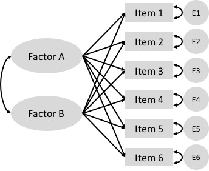
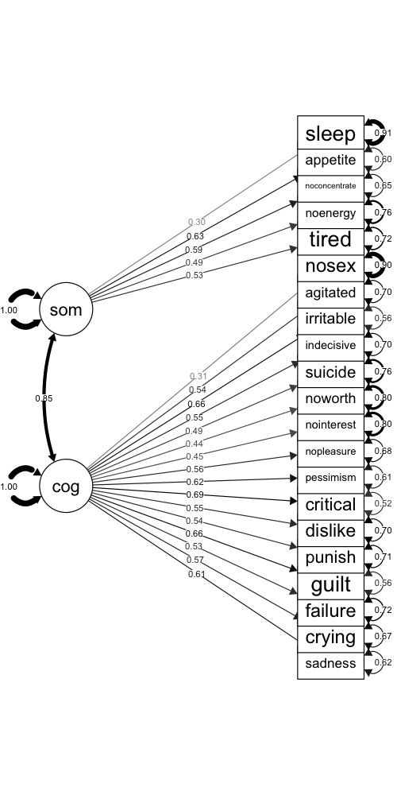

# Factor Analysis {#dimensionality}

> All examination, therefore, in the different sensory, school, or other specific intellectual faculties, may be regarded as so many independently obtained estimates of the one great common Intellective Function.
> --- Charles Spearman

Factor analysis is a multivariate statistical method used to evaluate relationships among a set of observed variables. The method was developed in the early 1900s by Charles Spearman, a psychologist interested in understanding the complexities of human intelligence. Spearman found that measures of different cognitive abilities were interrelated and could be efficiently expressed in terms of a single underlying factor, "the one great common Intellective Function," also known as general intelligence or the *g factor* [@spearman1904general].

Since Spearman's early research on intelligence, factor analysis has been studied and applied in a variety of fields, including psychology, education, economics, and political science. The common thread in these different fields is the focus on measuring unobserved variables as potential causes of or explanations for observed behavior.

This chapter gives an overview of two popular applications of factor analysis, called exploratory factor analysis or EFA and confirmatory factor analysis or CFA, with details on how each is used in test development. Real data examples come from the PISA data set. The learning objectives for this chapter focus on understanding the basic concepts involved in EFA and CFA, recognizing how they're appropriately applied, including common applications of each, and interpreting results.

```{block, type="objectives"}
**Learning objectives**

1. Compare and contrast the factor analytic model with other measurement models, including CTT and IRT, in terms of their applications in instrument development.
2. Describe the differing purposes of exploratory and confirmatory factor analysis.
3. Explain how an EFA is implemented, including the type of data required and steps in setting up and fitting the model.
4. Interpret EFA results, including factor loadings and eigenvalues.
5. Use a scree plot to visually compare factors in an EFA.
6. Explain how a CFA is implemented, including the type of data required and steps in setting up and fitting the model.
5. Interpret CFA results, including factor loadings and fit indices.
```

In this chapter we will run EFA and plot results using epmr functions. We'll also install a new package called lavaan for running CFA.

```{r eval=FALSE, append=TRUE, chap=8}
# R setup for this chapter
library("epmr")
# We're using a new package for CFA called lavaan
install.packages("lavaan")
library("lavaan")
# Functions we'll use
# fastudy() and plot() from epmr
# lavaanify() and cfa() from lavaan
```

```{r include=FALSE, echo=FALSE}
library("epmr")
library("lavaan")
```

## Measurement models

In previous chapters, we referred to unobserved variables as *constructs.* These somewhat metaphysical thingamajigs were first introduced within measures of sociability and attitude toward animals (Chapter \@ref(measurement)), and then they returned as the true score in classical test theory (Chapter \@ref(reliability)) and the latent trait in item response theory (Chapter \@ref(irt)). The term *factor* is synonymous with *construct,* and refers to an underlying and unobservable trait, characteristic, or attribute assumed to cause or give rise to the observable behavior we measure and score using test items.

So, we now have three terms, *construct*, *latent trait*, and *factor*, that all refer essentially to the same thing, the underlying, unobserved variable of interest that we expect is causing people to differ in their test scores.

The constructs that we encounter in factor analysis, which we will refer to as *factors*, are qualitatively the same as the ones we encountered with CTT and IRT. In fact, the CTT and IRT models presented in this book could be considered special, focused applications of factor analysis within situations where we assume that *a single construct* is sufficient for explaining the correlations among observed variables, our test items. In CTT and IRT, we use a measurement model to summarize the similarities in scores across multiple items in terms of *a single unobserved variable*, the true score or theta, which we identify as the cause or source of variability in scores.

Factor analysis can be used more generally to identify *multiple unobserved variables*, or factors, that explain the correlations among our observed variables. So, the primary distinction between factor analysis and the measurement models we've seen so far is in the number of factors. The main objective of factor analysis within educational and psychological measurement is to explore the *optimal reduced number* of factors required to represent *a larger number* of observed variables, in this case, dichotomous or polytomous test scores.

Note the emphasis here on the number of factors being smaller than the number of observed variables. Factor analysis is a method for summarizing correlated data, for reducing a set of related observed variables to their essential parts, the unobserved parts they share in common. We cannot analyze more factors than we have observed variables. Instead, we'll usually aim for the simplest factor structure possible, that is, the fewest factors needed to capture the gist of our data.

In testing applications, factor analysis will often precede the use of a more specific measurement model such as CTT or IRT. In addition to helping us summarize correlated data in terms of their underlying essential components, factor analysis also tells us how our items relate to or *load on* the factors we analyze. When piloting a test, we might find that some items relate more strongly to one factor than another. Other items may not relate well to any of the identified factors, and these might be investigated further and perhaps removed from the test. After the factor analysis is complete, CTT or IRT could then be used to evaluate the test further, and to estimate test takers' scores on the construct. In this way, factor analysis serves as a tool for examining the different factors underlying our data, and refining our test to include items that best assess the factors we're interested in measuring.

Recall that classical item analysis, discussed in Chapter \@ref(itemanalysis), can also be used to refine a test based on features such as item difficulty and discrimination. Discrimination in CTT, which resembles the slope parameter in IRT, is similar to a *factor loading* in factor analysis. A factor loading is simply an estimate of the relationship between a given item and a given factor. Again, the main difference in factor analysis is that we'll often examine multiple factors, and the loadings of items on each one, rather than a single factor as in CTT.

The model in Figure \@ref(fig:efa-model) contains a visual representation of a factor analysis where two factors are estimated to cause observed responses across a set of items. Remember that unidirectional arrows denote causal relationships. The underlying constructs, in ovals, are assumed to cause the observed item responses, in boxes. Bidirectional arrows denote correlations, where there is no clear cause and effect. The two factors, labeled Factor A and Factor B, each show a causal relationship with responses on all six items. Thus, each item is estimated to load on each factor. This is a unique feature of exploratory factor analysis, discussed next.

```{r efa-model, echo = FALSE, out.width='50%', fig.cap = "A simple exploratory factor analysis model for six items loading on two correlated factors."}

```

## Exploratory factor analysis

Exploratory factor analysis or EFA is used to *explore* the factor structure of a test or instrument. We may not know or understand well the number and types of factors that explain correlations among our items and how these factors relate to one another. So, we explore.

**The Beck Depression Inventory**

Here's an example. In Chapters \@ref(measurement) and \@ref(development) we referred to the Beck Depression Inventory, the latest version of which, the BDI-II, was published in 1996 [@beck1996manual]. The BDI-II contains 21 items measuring depressive symptomology. Each item is scored from 0 to 3, and a total score is used to determine a person's level of depression, whether minimal (scores of 0 to 13), mild (14 to 19), moderate (20 to 28), or severe (29 to 63).

The epmr package contains data from the BDI-II in the form of correlation and covariance matrices, as reported in Table 2 of @whisman2000factor. Each value in the correlation matrix is a correlation between scores on a given pair of BDI-II items. These are based on an administration of the BDI-II to 576 undergraduate students. See `?BDI` for details. In the interest of space, we'll just print the first four rows and columns of the correlation matrix. Note that the diagonal elements of the matrix are all 1.00, as a variable always correlates perfectly with itself.

```{r, append=TRUE, chap=8}
# Subset of correlations from BDI data set in the epmr 
# package
BDI$R[1:4, 1:4]
```

Some questions we might ask about the BDI-II include, do the items all measure the same thing? Or do they measure different things? Is depression a unidimensional construct? Or is it multidimensional, involving different underlying components? And do these components capture meaningful amounts of variability in observed depression scores? Or do scores function independently with little shared variability between them? These are questions we can begin to answer with EFA.

Suppose that a single factor is best, with all of the items loading strongly on it and only loading to a small degree on other factors. In this case, we could assume that the single factor represents an overall measure of depression, and all of the items contribute to the measure. Alternatively, suppose that the items don't consistently load on any one factor, but instead are influenced by numerous less important ones. In this case, each item may measure a distinct and unique component of depression that does not relate to the other measured components. Finally, what if the items tend to function well together in groups? Perhaps some items tend to correlate strongly with one another because they all measure a similar component of depression.

A number of studies have explored the factor structure of the BDI-II. EFA results tend to show that two factors account for the correlations in scores. The first factor seems to capture more *cognitive* depressive symptoms. The items loading on the cognitive factor measure feelings of guilt, irritability, sadness, and loss of interest. The second factor seems to capture more *somatic* symptoms. The items loading on the somatic factor involve depressive feelings that can manifest physically, such as loss of energy, changes in appetite, and difficulty staying on task. The somatic items may load to a lesser degree on the cognitive factor, but they tend to load more strongly together on the somatic factor, and vice versa.

The presence of two factors on the BDI-II suggests that subscores based on each factor may provide more detailed information about where an individual's depressive symptoms lie. For example, consider two patients each with the same total score of 18 across all 21 items. Using the published cutoffs, each patient would be categorized as having mild depression. However, one patient may have scored highly only on the somatic items, whereas the other may have scored highly only on the cognitive ones. These differences are not evident in a single total score. Factor analysis suggests that subscores interpretations in cases like this may be justified.

We'll come back to the BDI-II later on, when we use a confirmatory factor analysis to examine the correlations in `BDI`.

### Steps in EFA

The BDI-II example above brings up some of the important steps in conducting an EFA. These steps involve choosing an initial number of factors to explore, preparing our data and fitting the EFA model, examining patterns in factor loadings and error terms, and evaluating factor quality and choosing a final factor structure.

**1. Choose the number of factors**

We start an EFA by choosing the number of factors that we want to explore, potentially up to the number of items in our data set, but preferably much fewer. This choice may simply be based on apparent similarities in the content of our test items. For example, in the field of industrial and organizational psychology, a test developer may be tasked with defining the key features of a particular job, so as to create a measure that identifies employees who are most likely to succeed in that job. Test content could be based initially on conversations with employees about their job responsibilities and the skills and traits they feel are most important to doing well. The test developer can then look for trends or themes in the test content. Perhaps some items have to do with loyalty, others with organizational skills, and the rest with being outgoing. Three factors seem appropriate here.

The initial choice of a number of factors may similarly be based on a test outline showing the intended structure of an instrument, with items already written specifically to fit into distinct scales. For example, educational tests are often designed from the beginning to assess one or more content domains. These domains usually map onto scales or subscales within a test. In turn, they can inform our choice of the number of factors to explore in an EFA.

When fitting an EFA, we will allow the model to identify more factors that we expect or hope to end up with. Some EFA software will automatically fit the maximum possible number of factors. R requires that we specify a number. By allowing for more factors than we initially choose, we get an idea of how our expectation compares with less parsimonious solutions. The maximum possible number of factors in an EFA depends on our sample size and the number of items in our test. A general guideline is to plan for at least 3 items loading primarily on each factor. So, a test with 13 items should have no more than 4 factors.

**2. Prepare the data and fit the model**

The factor analysis models discussed in this chapter require that our items be measured on continuous scales, and that our factors of interest be expressed in terms of continuous scores. With dichotomously scored items, we need to adjust our data, and this process will not be covered here. Instead, we will examine polytomous items with responses coming from rating scales. These data may not be strictly continuous, but we will assume that they are continuous enough to support the corresponding EFA.

Factor analysis requires either a scored data set, with people in rows and observations (scored item responses) in columns, or a correlation matrix based on such a data set. In the first demonstration below we'll use a data set, and in the second we'll use a correlation matrix. When using a data set, the data are prepared simply be ensuring that all of the variables contain scored item responses. We will remove any incomplete cases.

Factor analysis also requires sufficient sample size given the number of items in our test and the number of parameters estimated in the model. One somewhat generous rule of thumb is to get five times as many people as observed variables. So, when piloting a test with 100 items, we would hope for complete data on at least 500 respondents. With small sample sizes and too many parameters, our EFA will not run or will fail to converge on a solution, in which case we may need to collect more data, reduce test length, or revise our proposed number of factors.

A variety of software packages are available for fitting EFA. Commercial software options include SPSS, SAS, and Mplus. We will use maximum likelihood methods in R, with functions from the base and epmr packages. Note that EFA is a complex statistical procedure and we are only scratching the surface in terms of customizing the model and tweaking the input and output. Topics such as estimation methods and rotation strategies will not be discussed here. Instead, we'll accept  recommended defaults, and focus on the more important considerations in running EFA and interpreting results.

**3. Examine factor loadings**

The EFA model estimates the relationships between each item on our test and each factor that the model extracts. These relationships are summarized within a factor loading matrix, with items in rows and loadings on each factor in columns. The loadings are usually standardized so as to be interpreted as correlations. Loadings closer to 0 indicate small or negligible relationships, whereas values closer to 1 indicate strong relationships. Most of the loadings we will see fall between 0 and 0.80.

Like with reliability coefficients, practical cutoffs for interpreting factor loadings depend on the type of instrument and data being analyzed, and on the field of research. As a general rule of thumb, loadings of 0.30 or higher may merit further interpretation, whereas loadings below 0.30 may not. In some situations, such as with shorter tests, smaller loadings around 0.20 may be interpreted as meaningful.

In an EFA, each item has its own unique error term, sometimes referred to as its *uniqueness*. This error consists of the leftover unexplained variance for an item, after removing the shared variance explained by the factors. The error terms in the EFA that we will examine are simply 1 minus the sum of the squared factor loadings for each item across factors. Because they measure the converse of the factor loadings, larger errors reveal items that do not fit well in a given model.

**4. Evaluate factor quality**

The EFA model also estimates the amount of variability in observed item scores that is explained by each factor. The concept of explained variability is related to the coefficient of determination from regression, and the reliability coefficient as presented in Chapter \@ref(reliability). In EFA, variability across all of our items can be standardized so that the variance per item is 1, and the sum of all the variances is simply the number of items. On a test with 13 items, the total variability would then be 13.

Variability explained for a given factor can be indexed using its standardized *eigenvalue*. An eigenvalue of 1 tells us that a factor only explains as much variability, on average, as a single item. On a test with 13 items, an eigenvalue of 13 (not likely) would tell us that a factor explains all of the available variability. On this same test, an eigenvalue of 3 would indicate that a factor explains as much variability as 3 items, and dividing 3 by 13 gives us 0.23, the proportion of total variability explained by this factor.

Larger standardized eigenvalues are better, as they indicate stronger factors that better represent the correlations in scores. Smaller eigenvalues, especially ones below 1, indicate factors that are not useful in explaining variability. Eigenvalues, along with factor loadings, can help us identify an appropriate factor structure for our test. We can reduce the number of factors and remove problematic items and then rerun our EFA to explore how the results change. This would bring us back to step 1.

**Confirming our factor structure**

In summary, we've outlined here four main steps in conducting an EFA.

1. Choosing a number of factors. Our choice should be reasonable and parsimonious, and based on the underlying constructs we expect will best summarize the correlations among our items. We should explore more than our chosen number of factors, ideally as many as possible, for comparison purposes.  
2. Preparing the data and fitting the model. Our data must be quantitative and measured on a relatively continuous scale. Our factors will be measured as continuous variables. We'll fit the model in R using the default options, as demonstrated below.  
3. Examining factor loadings, which estimate the relationship between each item and each modeled factor. Larger values indicate stronger relationships.  
4. Evaluate factors via eigenvalues, which estimate the total variance explained by each factor. Eigenvalues are compared to the number of items, and can be used to identify the factors that capture the most variability in scores.  

Having completed these steps, the EFA should point us in the right direction in terms of finding a suitable number of factors for our test, and determining how our items load on these factors. However, because EFA does not involve any formal hypothesis testing, the results are merely descriptive. The next step involves a confirmatory analysis of the factor structure that we think is most appropriate for our test. Following a demonstration of EFA with PISA data, we'll learn more about the role of CFA in test development.

### Exploring PISA Approaches to Learning

The Approaches to Learning scale from the PISA 2009 student questionnaire contains 13 items measuring the strategies students use when learning. These items were separated by the PISA developers into the three subscales of memorization, elaboration, and control strategies. See the full text for the items in Appendix \@ref(appendixb).

**Choose factors, prep data, fit model**

Note that the `PISA09` data set includes IRT theta scores on each subscale, as estimated by PISA (`PISA09$memor`, `PISA09$elab`, and `PISA09$cstrat`). We'll look at these later. For now, let's explore an EFA model for all 13 items, with three factors specified. Given the small number of items, four factors may also work, but any more is not recommended. We will use the `fastudy()` function from the epmr package, which runs an EFA using `factanal()` from the base package.

```{r, append=TRUE, chap=8}
# Prepping PISA approaches to learning data for EFA
# Vectors of item names for memorization, elaboration, and
# control strategies
mitems <- c("st27q01", "st27q03", "st27q05", "st27q07")
eitems <- c("st27q04", "st27q08", "st27q10", "st27q12")
citems <- c("st27q02", "st27q06", "st27q09", "st27q11", 
  "st27q13")
alitems <- c(mitems, eitems, citems)
# Reduce to complete data for Great Britain
pisagbr <- subset(PISA09, subset = cnt == "GBR", select = alitems)
pisagbr <- na.omit(pisagbr)
# Fit EFA with three factors
alefa <- fastudy(pisagbr, factors = 3)
```

**Examine factor loadings**

Having fit an EFA with three factors, we'll first examine the loadings. The loadings matrix shows the 13 approaches to learning variable names in rows, and the three factors in columns. The values in a given row are the loadings for an item across the three factors. By default, values below 0.1 are not displayed when the matrix of factor loadings is printed to the R console. This simplifies our visual inspection of the results.

```{r, append=TRUE, chap=8}
# Print approaches to learning EFA results
print(alefa, digits = 2)
```

The first four items in the table pertain to the memorization scale. Notice that they load strongest on factor 3, with loadings of 0.66, 0.66, 0.49, and 0.40. Two of the memorization items also load above 0.1 on factor 1, and three load above 0.1 on factor 2.

The next four items pertain to the elaboration scale. These load strongest on factor 1, with loadings of 0.44, 0.63, 0.67, and 0.74. They all also load somewhat on factor 2, and one loads on factor 3.

Finally, the last five items pertain to the control strategies scale. Loadings tended to be strongest for factor 2, with 0.38, 0.64, 0.59, 0.55, and 0.52. All of the control strategies items also had small loadings on the other two factors.

By increasing the cutoff when printing the loadings matrix, we can highlight visually where the stronger factor loadings are located. The trends described above, with scale items loading together on their own factors, become more apparent.

```{r, append=TRUE, chap=8}
# Print results again, rounding and filtering loadings
print(alefa, digits = 2, cutoff = 0.3)
```

Note that item `st27q02` had a larger loading on factor 3, the memorization factor, than on factor 2. This suggests that this item is measuring, in part, a learning strategy that involves a skill related to memorization. The item may fit better in the memorization scale than the control scale.

The item error terms summarize the unexplained variability for each item. Items with larger factor loadings will have lower errors, and vice versa. Here, we confirm that the errors, contained in `alefa$uniquenesses`, are 1 minus the sum of squared factor loadings.

```{r, append=TRUE, chap=8}
# Print uniquenesses, and check sum of squared loadings
round(alefa$uniquenesses, 2)
round(rowSums(alefa$loadings^2) + alefa$uniquenesses, 2)
```

**Evaluate factors**

The factor loadings tend to support the alignment of the approaches to learning items into their corresponding scales. However, the results also show that many of the items are related to more than just the scales they were written for. This could be due to the fact that the three factors measure related components of a broader learning strategies construct. Correlations between the IRT theta scores provided by PISA for each scale are all moderately positive, suggesting overlap in what the scales are measuring.

```{r, append=TRUE, chap=8}
# Correlations between PISA approaches to learning scores
# for Great Britain
round(cor(subset(PISA09, cnt == "GBR", c("memor", "elab", 
  "cstrat")), use = "c"), 2)
```

Next, we can look at the eigenvalues for the factors, to determine the amount of total score variability they each capture. The R output labels the eigenvalues as `SS loadings`, since they are calculated as the sum of the squared loadings for each factor. The EFA results show eigenvalues of 1.85, 1.84, and 1.73, which each represent about 14% of the total score variability, for a cumulative variance explained of 42%. These results indicate that the majority of variability in approaches to learning scores is still unexplained.

We can visually compare eigenvalues across factors using what's called a *scree plot*. In the plot, factors are listed out on the x-axis, and eigenvalues are compared vertically in terms of their magnitude on the y-axis. Factors are presented in decreasing order by eigenvalue, with the largest value to the left and the smallest to the right. In a model with a strong primary factor that accounts for a large portion of the variability, the line connecting the eigenvalues across factors resembles a precipice that sharply declines and then leaves a pile of scree or rubble at the bottom. Hence, the name scree plot.

```{r, append=TRUE, chap=8}
# Plot of approaches to learning eigenvalues
plot(alefa, ylim = c(0, 3))
```

The scree plot for the Approaches to Learning EFA with three factors resembles more of a plain than a cliff edge. The eigenvalues are all above 1, which is sometimes used as a cutoff for acceptability. They're also all nearly equal.

With other types of tests where one or two strong underlying constructs are present, the scree effect will be more apparent. Here is an example based on the `BDI$R` correlation matrix presented above. The plot shows that the first two factors have eigenvalues near or above 2, whereas the rest are near or below 1. These first two factors correspond to the cognitive and somatic factors described above. Together they account for 26% of the variance.

```{r, append=TRUE, chap=8}
# Plot of eigenvalues for BDI
bdiefa <- fastudy(covmat = BDI$S, factors = 12,
  n.obs = 576)
plot(bdiefa, ylim = c(0, 3))
```

Returning to the PISA 2009 Approaches to Learning scale, the EFA leads us to conclude first that the 13 items provide only a limited picture of the three subscales being measured. Four to five items per scale and per factor does not appear to be sufficient. Although loadings were moderate, and aligned as expected onto the corresponding subscales, more items would likely improve the variance explained by each factor. Given these limitations, computing theta values based on unidimensional IRT models for each subscale may not be appropriate. However, such short scales may be justified given the practical constraints on testing time with PISA.

## Confirmatory factor analysis

Confirmatory factor analysis or CFA is used to confirm an appropriate factor structure for an instrument. Whereas EFA provides tools for exploring factor structure, it does not allow us to modify specific features of our model beyond the number of factors. Furthermore, EFA does not formally support the testing of model fit or statistical significance in our results. CFA extends EFA by providing a framework for proposing a specific measurement model, fitting the model, and then testing statistically for the appropriateness or accuracy of the model given our instrument and data.

Note that CFA falls within a much broader and more general class of structural equation modeling (SEM) methods. Other applications of SEM include path analysis, multilevel regression modeling, and latent growth modeling. CFA and SEM models can be fit and analyzed in R, but, given their complexity, commercial software is often preferable, depending on the model and type of data used. For demonstration purposes, we will examine CFA in R using the lavaan package.

**The BDI-II**

Let's consider again the BDI-II, discussed above in terms of EFA. Exploring the factor structure of the instrument gives us insights into the number of factors needed to adequately capture certain percentages of the variability in scores. Again, results indicate that two factors, labeled in previous studies as cognitive and somatic, account for about a quarter of the total score variance. In the plot above, these two factors clearly stand out above the scree. But the question remains, is a two factor model correct? And, if so, what is the best configuration of item loadings on those two factors?

In the end, there is no way to determine with certainty that a model is correct for a given data set and instrument. Instead, in CFA a model can be considered *adequate* or *appropriate* based on two general criteria. The first has to do with the explanatory power of the model. We might consider a model adequate when it exceeds some threshold for percentage of variability explained, and thereby minimizes in some way error variance or variability unexplained. The second criterion involves the relative appropriateness of a given model compared to other competing models. Comparisons are typically made using statistical estimates of model fit, as discussed below.

Numerous studies have employed CFA to test for the appropriateness of a two factor structure in the BDI-II. @whisman2000factor proposed an initial factor structure that included five BDI-II items loading on the somatic factor, and 14 items loading on the cognitive factor (the authors label this factor cognitive-affective). The remaining two items, Pessimism and Loss of Interest in Sex, had been found in exploratory analyses not to load strongly on either factor. Thus, loadings for these were not estimated in the initial CFA model.

Results for this first CFA showed poor fit. @whisman2000factor reported a few different fit indices, including a Comparative Fit Index (CFI) of 0.80 and a Root Mean Square Error of Approximation (RMSEA) of 0.08. Commonly used thresholds for determining "good fit" are CFI at or above 0.90 and RMSEA at or below 0.05.

An important feature of factor analysis that we have not yet discussed has to do with the relationships among item errors. In EFA, we assume that all item errors are uncorrelated. This means that the unexplained variability for a given item does not relate to the unexplained variability for any other. Similar to the CTT model, variability in EFA can only come from the estimated factors or random, uncorrelated noise. In CFA, we can relax this assumption by allowing certain error terms to correlate.

@whisman2000factor allowed error terms to correlate for the following pairs of items: sadness and crying, self-dislike and self-criticalness, and loss of pleasure and loss of interest. This choice to have correlated errors seems justified, given the apparent similarities in content for these items. The two factors in the initial CFA didn't account for the fact that respondents would answer similarly within these pairs of items. Thus, the model was missing an important feature of the data.

Having allowed for correlated error terms, the two unassigned items Pessimism and Loss of Interest in Sex were also specified to load on the cognitive factor. The result was a final model with more acceptable fit statistics, including CFI of 0.90 and RMSEA of 0.06.

### Steps in CFA

Here, we will fit the final model from @whisman2000factor, while demonstrating the following basic steps in conducting a CFA:

1. hypothesizing the proposed factor structure with necessary constraints,
2. preparing our data and fitting the CFA model,
3. evaluating the model and statistically testing for model fit,
4. revising the model, comparing to more or less complex models, and repeating evaluation and testing of fit as needed.

**1. Hypothesize the factor structure**

As discussed previously, we hypothesize that two factors will be sufficient for explaining the correlations among items in the BDI-II. These factors are labeled cognitive and somatic, based on the content of the items that tend to load on them. We also hypothesize that the two factors will be correlated. Finally, we allow for correlated errors between sadness and crying, self-dislike and self-criticalness, and loss of pleasure and loss of interest.

Figure \@ref(fig:bdi-model) is a visual representation of the CFA model we're fitting. On the left are the two factors, and on the right are the observed item variables. Estimates for the correlation between factors, the factor loadings, and item variances are also shown.

```{r bdi-model, echo = FALSE, out.width='50%', fig.cap = "CFA model for the BDI-II, with factor loadings and error variances."}

```

**2. Prepare the data, fit the model**

We assume that the scored item responses on the BDI-II represent continuous variables. The covariance matrix in `BDI$S` was obtained using the 576 respondents having complete data across all 21 items. As reported in @whisman2000factor, the mean total score was 8.36 with SD 7.16. Thus, on average, respondents were in the minimal depression score range, though some had scores in the mild and moderate ranges, and a few fell in the severe range.

Considering the complexity of our model, the sample size of 576 should be sufficient for estimation purposes. Since different CFA models can involve different numbers of estimated parameters for the same number of items, sample size guidelines are usually stated in terms of the number of parameters rather than the number of items. We'll consider the recommended minimum of five times as many people as parameters. The total number of parameters estimated by our model will be 43, with 21 factor loadings, 21 error variances, and the correlation between the cognitive and somatic factors.

We fit our CFA using the covariance matrix in `BDI$S`. The `cfa()` function in the lavaan package requires that we name each factor and then list out the items that load on it after the symbol `=~`. Here, we label our cognitive factor cog and somatic factor som. The items listed after each factor must match the row or column names in the covariance matrix, and must be separated by `+`.

The `lavaanify()` function will automatically add error variances for each item, and the correlation between factors, so we don't have to write those out. We do need to add the three correlated error terms, for example, with `sadness ~~ crying`, where the `~~` indicates that the variable on the left covaries with the one on the right.

The model is fit using the `cfa()` function. We supply the model specification object that we created above, along with the covariance matrix and sample size.

```{r, append=TRUE, chap=8}
# CFA of BDI using the lavaan package
# Specify the factor structure
# Comments within the model statement are ignored
bdimod <- lavaanify(model = "
  # Latent variable definitions
  cog =~ sadness + crying + failure + guilt + punish +
    dislike + critical + pessimism + nopleasure +
    nointerest + noworth + suicide + indecisive +
    irritable + agitated + nosex
  som =~ tired + noenergy + noconcentrate + appetite +
    sleep
  # Covariances
  sadness ~~ crying
  dislike ~~ critical
  nopleasure ~~ nointerest",
  auto.var = TRUE, auto.cov.lv.x = TRUE, std.lv = TRUE)
# Fit the model
bdicfa <- cfa(bdimod, sample.cov = BDI$S,
  sample.nobs = 576)
```

**3. Evaluate the model**

To evaluate the model that's stored in the object `bdicfa`, we send it to the lavaan `summary()` function, while requesting fit indices with the argument `fit = TRUE`. Lots of output are printed to the console, including a summary of the model estimation, some fit statistics, factor loadings (under Latent Variables), covariances, and variance terms (including item errors).

The CFI and RMSEA are printed in the top half of the output. Neither statistic reaches the threshold we'd hope for. CFI is 0.84 and RMSEA is 0.07, indicating less than optimal fit.

Standardized factor loadings are shown in the last column of the Latent Variables output. Some of the loadings match up well with those reported in the original study. Others are different. The discrepancies may be due to the fact that our CFA was run on correlations rounded to two decimal places that were converted using standard deviations to covariances, whereas raw data were used in the original study. Rounding can result in a loss of meaningful information.

```{r, append=TRUE, chap=8}
# Print fit indices, loadings, and other output
summary(bdicfa, fit = TRUE, standardized = TRUE)
```

**4. Revise as needed**

The discouraging CFA results may inspire us to modify our factor structure in hopes of improving model fit. Potential changes include the removal of items with low factor loadings, the correlating of more or fewer error terms, and the evaluation of different numbers of factors. Having fit multiple CFA models, we can then compare fit indices and look for relative improvements in fit for one model over another.

Let's quickly examine a CFA where all items load on a single factor. We no longer have correlated error terms, and item errors are again added automatically. We only specify the loading of all items on our single factor, labeled depression.

```{r, append=TRUE, chap=8}
# Specify the factor structure
# Comments within the model statement are ignored as
# comments
bdimod2 <- lavaanify(model = "
  depression =~ sadness + crying + failure + guilt +
    punish + dislike + critical + pessimism + nopleasure +
    nointerest + noworth + suicide + indecisive +
    irritable + agitated + nosex + tired + noenergy +
    noconcentrate + appetite + sleep",
  auto.var = TRUE, std.lv = TRUE)
# Fit the model
bdicfa2 <- cfa(bdimod2, sample.cov = BDI$S,
  sample.nobs = 576)
# Print output
summary(bdicfa2, fit = TRUE, standardized = TRUE)
```

We can compare fit indices for our two models using the `anova()` function. This comparison requires that the same data be used to fit all the models of interest. So, it wouldn't be appropriate to compare `bdimod` with another model fit to only 20 of the 21 BDI-II items.

Three comparison statistics are provided by `anova()`. With Akaike's Information Criterion (AIC) and the Bayesian Information Criterion (BIC), we're looking for the model with the smallest value. Smaller AIC and smaller BIC from one model to the next indicate better fit. The chi-square statistic has a p-value associated with it, where a p-value below a certain cutoff such as 0.05 would indicate significantly better fit for one model over another.

```{r, append=TRUE, chap=8}
# Compare fit for BDI CFA models
anova(bdicfa2, bdicfa)
```

Of these three fit comparison statistics, we will focus on AIC and BIC. The AIC and BIC both increase from the model with two factors to the model with only one. This indicates poorer model fit for the depression model.

Overall, results for the unidimensional model are no better than for the previous one. The AIC and BIC are both larger, and the CFI and RMSEA are relatively unchanged. Most loadings are moderately positive, but some leave a substantial amount of item variability unexplained. For example, the item error terms (in the Std.all column of the Variances table) for sleep and noenergy are both larger than 0.80. These results indicate that more than 80% of the variability is unexplained for these items. Errors for the remaining items are all above 0.50.

Taken together, the results of these CFA suggest that the two-factor and unidimensional models may not be appropriate for the BDI-II, at least in the undergraduate population with which the data were collected.

### Confirming PISA Approaches to Learning

In our final demonstration, we'll fit a CFA to the PISA Approaches to Learning items. Our first factor structure is similar to what we explored previously via EFA. However, here, our items are only allowed to load on their intended factors. We're hypothesizing that any cross loadings on other factors are negligible and not essential to the underlying factor structure for the instrument.

```{r, append=TRUE, chap=8}
# CFA with PISA approaches to learning scale
# Specify the factor structure
almod <- lavaanify(model = "
  # Three factors
  memor =~ st27q01 + st27q03 + st27q05 + st27q07
  elab =~ st27q04 + st27q08 + st27q10 + st27q12
  cstrat =~ st27q02 + st27q06 + st27q09 + st27q11 +
    st27q13",
  auto.var = TRUE, auto.cov.lv.x = TRUE, std.lv = TRUE)
# Fit the model
alcfa <- cfa(almod, sample.cov = cov(pisagbr[, alitems]),
  sample.nobs = 3514)
# Print output
summary(alcfa, fit = TRUE, standardized = TRUE)
```

Model fit is not as strong as we would hope. The CFI is 0.89 and the RMSEA is 0.08. As with the BDI-II, loadings are moderately positive, but they leave the majority of the item variance unexplained. These results suggest that the Approaches to Learning constructs may not be strong enough or distinct enough to warrant the calculation of scale scores across the memorization, elaboration, and control items.

## Summary

This chapter presented two popular methods for conducting factor analysis, one that provides descriptive and relatively unstructured information about a test, and the other providing more structured results oriented around formal hypotheses. The main steps involved in fitting EFA and CFA and evaluating results were discussed and demonstrated using real data.

EFA and CFA can improve the test development process by allowing us to examine and confirm the presence of unobserved constructs that explain variability in our tests. In practice, tests without a confirmed factor structure may not be suitable for testing applications that require a total score calculated across items, in the case of unidimensional factor models, or scores across subscales, in the case of multidimensional models.

### Exercises

1. Suppose an EFA is fit to data collected on a test containing 18 items. Ten factors are explored in the EFA. The eigenvalues for the first three factors are 4.5, 3.0, and 2.5. Describe what these values represent.
2. Convert the eigenvalues from the previous question to percentages of variance explained. How much variability do the three factors account for together?
3. Draw a scree plot for the EFA described in the previous two questions, using the eigenvalues given for the first three factors and eigenvalues of 0.8 for the remaining factors.
4. Run three separate CFA models, with one factor each, on the memorization, elaboration, and control strategy scales. Evaluate the results based on model fit and factor loadings.